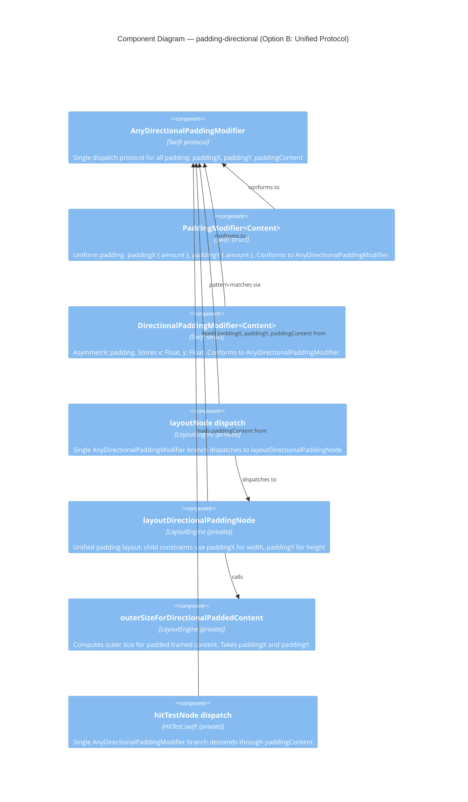

# Architecture Proposal — padding-directional

## The Question: Do We Need Two Types?

The "square is a special case of rectangle" observation is exactly right — and the resolution in immutable value types is cleaner than in mutable OOP. In mutable OOP the Square-Rectangle problem is a Liskov Substitution Principle violation: if you make `Square` a subtype of `Rectangle` with `setWidth`, calling `setWidth(5)` on a `Square` must also change its height to maintain its invariant, which surprises any caller that expected only width to change. The subtype breaks the substitutability guarantee the moment mutation enters the picture.

In an immutable value-type system there is no mutation, so the problem dissolves entirely. `PaddingModifier(amount: a)` has a fixed value — it never changes. Treating it as a `DirectionalPaddingModifier(x: a, y: a)` is not a lie; it is a factual projection. Every operation that is valid on a directional padding modifier is equally valid on a uniform one, and no invariant can be violated post-construction because nothing can be written after init. The architectural consequence: the protocol unification is not just permissible — it is semantically precise.

---

## Reuse Analysis

| Existing Component | File | Overlap | Decision | Justification |
|---|---|---|---|---|
| `PaddingModifier` | `Sources/GameUI/View.swift` | Uniform padding — a degenerate case of directional padding where paddingX == paddingY | EXTEND (add conformance to `AnyDirectionalPaddingModifier`) | The type is correct. Its stored `amount: Float` projects onto `paddingX` and `paddingY` without loss. No new type needed for the uniform case. |
| `AnyPaddingModifier` | `Sources/GameUI/View.swift` | Protocol for uniform padding dispatch — `paddingAmount`, `paddingContent` | RETIRE (remove after conformance migration) | `AnyDirectionalPaddingModifier` subsumes all of its responsibilities. The protocol has no callers outside the library. Its removal is a public API break that is assessed as low-risk (see Breaking Changes). |
| `layoutPaddingNode` | `Sources/GameUI/LayoutEngine.swift` | Layout logic for uniform padding | REPLACE with `layoutDirectionalPaddingNode` | The replacement accepts `paddingX` and `paddingY` independently; the uniform case is handled transparently (both axes carry the same value). No parallel implementation needed. |
| `AnyPaddingModifier` branch in `layoutNode` | `Sources/GameUI/LayoutEngine.swift` | Dispatch to `layoutPaddingNode` | REPLACE (single `AnyDirectionalPaddingModifier` branch) | Eliminating the parallel branch removes the risk of dispatch-order bugs (DISCUSS D6) and halves the pattern-match cost for all padding nodes. |
| `AnyPaddingModifier` branch in `hitTestNode` | `Sources/GameUI/HitTest.swift` | Traversal through padding to child view | REPLACE (single `AnyDirectionalPaddingModifier` branch) | Same reasoning as `layoutNode`. The traversal logic is identical: descend through `paddingContent`. No behavioral change. |
| `outerSizeForPaddedContent` | `Sources/GameUI/LayoutEngine.swift` | Computes outer size for padded content given a uniform `amount: Float` | REPLACE with `outerSizeForDirectionalPaddedContent(paddingX:paddingY:)` | Signature must change from a single `amount` to separate `paddingX`/`paddingY`. The replacement is a one-to-one swap; the uniform case passes the same value for both parameters. |

---

## Option A: Two Types, Two Protocols (DISCUSS design — status quo)

Keep `PaddingModifier` and `AnyPaddingModifier` exactly as-is. Add `DirectionalPaddingModifier<Content>` and `AnyDirectionalPaddingModifier` as parallel structures. Add a second dispatch branch in `layoutNode` (check `AnyDirectionalPaddingModifier` before `AnyPaddingModifier` per DISCUSS D6). Add a second branch in `hitTestNode`.

**Pros:**
- Zero changes to existing code — no risk of regression in the uniform padding path.
- DISCUSS D5 ("do not reuse `outerSizeForPaddedContent`") is already resolved without any refactoring.
- Reviewers reading `View.swift` see two clearly distinct modifier types.

**Cons:**
- Two protocols with nearly identical shapes (`paddingContent` appears in both; only `paddingAmount` vs `paddingX`/`paddingY` differs).
- Two dispatch branches in both `layoutNode` and `hitTestNode` — dispatch-order sensitivity becomes a permanent maintenance burden (DISCUSS D6 risk never closes).
- The DISCUSS risk table entry "Dispatch order: `AnyDirectionalPaddingModifier` shadowed by `AnyPaddingModifier`" stays open indefinitely.
- The design encodes a false model: uniform padding appears to be unrelated to directional padding, when it is actually a special case.

**Verdict:** Viable but carries avoidable structural debt. Correct for a first slice under time pressure; suboptimal as a permanent design.

---

## Option B: Unify at Protocol Level (Recommended)

Declare `AnyDirectionalPaddingModifier` as the single padding dispatch protocol with three members: `paddingX: Float`, `paddingY: Float`, `paddingContent: any View`. Extend `PaddingModifier` to conform: `var paddingX: Float { amount }`, `var paddingY: Float { amount }`. Retire `AnyPaddingModifier`. Replace `layoutPaddingNode` with `layoutDirectionalPaddingNode(paddingX:paddingY:)`. Replace `outerSizeForPaddedContent(amount:)` with `outerSizeForDirectionalPaddedContent(paddingX:paddingY:)`. Collapse to one dispatch branch in both `layoutNode` and `hitTestNode`.

**Protocol definition:**
```
public protocol AnyDirectionalPaddingModifier {
    var paddingX: Float { get }
    var paddingY: Float { get }
    var paddingContent: any View { get }
}
```

**PaddingModifier extended (no stored property change):**
```
// PaddingModifier gains conformance; no new stored state, no init change.
// paddingX and paddingY are computed projections of the existing `amount`.
extension PaddingModifier: AnyDirectionalPaddingModifier {
    public var paddingX: Float { amount }
    public var paddingY: Float { amount }
}
// AnyPaddingModifier conformance and paddingAmount property can be removed
// once all callers are migrated to AnyDirectionalPaddingModifier.
```

**DirectionalPaddingModifier:**
```
public struct DirectionalPaddingModifier<Content: View>: View, AnyDirectionalPaddingModifier {
    public let content: Content
    public let x: Float
    public let y: Float

    public var paddingX: Float { x }
    public var paddingY: Float { y }
    public var paddingContent: any View { content }

    public var body: Never { fatalError("DirectionalPaddingModifier is a primitive view") }
}
```

**`layoutDirectionalPaddingNode` signature:**
```
private func layoutDirectionalPaddingNode(
    _ padded: any AnyDirectionalPaddingModifier,
    in constraints: LayoutConstraints,
    origin: Point
) -> LayoutNode
```

**`outerSizeForDirectionalPaddedContent` signature:**
```
private func outerSizeForDirectionalPaddedContent(
    _ content: any View,
    paddingX: Float,
    paddingY: Float,
    constraints: LayoutConstraints
) -> Size
```

**Dispatch in `layoutNode` (single branch):**
```
if let padded = view as? any AnyDirectionalPaddingModifier {
    return layoutDirectionalPaddingNode(padded, in: constraints, origin: origin)
}
```

**Dispatch in `hitTestNode` (single branch):**
```
if let padded = view as? any AnyDirectionalPaddingModifier {
    if !node.children.isEmpty {
        return hitTestNode(padded.paddingContent, node.children[0], at: point, index: &index)
    }
    return nil
}
```

**Pros:**
- Single dispatch branch — dispatch-order risk (DISCUSS D6) is permanently closed.
- Protocol hierarchy reflects the semantic reality: uniform padding is a special case of directional padding.
- No duplicate layout or traversal logic.
- `padding(_ amount:)` still returns `PaddingModifier<Self>` — the concrete return type and the extension call-site are unchanged for all existing callers.
- `outerSizeForPaddedContent` is replaced rather than duplicated; the replacement is a strict generalization.

**Cons:**
- `AnyPaddingModifier` is `public` — removing it is a source-breaking change for any external caller that references the protocol by name. Assessed as low-risk: see Breaking Changes section.
- `PaddingModifier` must be changed (add two computed properties, remove one). One file touched in the existing path.

**Verdict:** Correct. Adopt.

---

## Option C: Subsume PaddingModifier Entirely

Replace `padding(_ amount: Float)` so it returns `DirectionalPaddingModifier<Self>` directly (calling `DirectionalPaddingModifier(content: self, x: amount, y: amount)`). Remove `PaddingModifier` and `AnyPaddingModifier` entirely. Single type, single protocol, single dispatch path.

**Pros:**
- Maximum DRY — one type for all padding, no `PaddingModifier` to maintain.
- Removes the most code.

**Cons:**
- `PaddingModifier` is `public` — removing it is a source-breaking change for any caller that names the type (e.g., `view as? PaddingModifier`, stored properties of type `PaddingModifier<T>`). More intrusive than removing the protocol.
- The concrete return type of `padding(_ amount:)` changes — any caller that captures the return in a typed variable (e.g., `let p: PaddingModifier<MyView> = view.padding(8)`) breaks at the call site.
- Removes a named concept (`PaddingModifier`) that is self-documenting.
- Saves approximately five lines of code over Option B at the cost of a broader breaking surface.

**Verdict:** Overshoots. Breaking the concrete type name is a larger cost than the benefit warrants when Option B achieves the same dispatch unification without it.

---

## Recommendation

**Option B.**

The user's observation — "uniform padding is a special case of directional padding" — is architecturally correct and should be encoded in the type system, not suppressed. Option B applies the insight at the right level: the protocol surface becomes unified while the concrete type (`PaddingModifier`) is preserved unchanged from external callers' perspective. This gives three outcomes simultaneously:

1. The dispatch-order fragility in DISCUSS D6 is eliminated structurally, not mitigated procedurally.
2. The `outerSizeForPaddedContent` duplication risk (DISCUSS D5) never arises — there is only one implementation.
3. The public API surface for game developers (`padding(_ amount:)` returns `PaddingModifier<Self>`) remains identical; no call-site migration is needed.

Option A defers the structural debt without ever paying it. Option C is architecturally cleaner in the abstract but breaks the concrete type, which is a larger public API surface to break than the protocol. Option B is the minimum change that makes the type hierarchy truthful.

---

## Component Boundaries

| Component | File | Responsibility | Boundary Rule |
|---|---|---|---|
| `AnyDirectionalPaddingModifier` | `Sources/GameUI/View.swift` | Single protocol for all padding dispatch. Exposes `paddingX: Float`, `paddingY: Float`, `paddingContent: any View`. | Public protocol. No stored state. No default implementations. |
| `PaddingModifier<Content>` (extended) | `Sources/GameUI/View.swift` | Uniform padding modifier. Gains conformance to `AnyDirectionalPaddingModifier` via computed `paddingX { amount }` and `paddingY { amount }`. Loses `AnyPaddingModifier` conformance (protocol retired). | Value type. No new stored properties. `padding(_ amount:)` return type unchanged. |
| `DirectionalPaddingModifier<Content>` | `Sources/GameUI/View.swift` | Asymmetric padding modifier. Stores `x: Float` and `y: Float` independently. Conforms to `AnyDirectionalPaddingModifier`. | Value type. `body` is `Never`. No layout logic. |
| `View.padding(x:y:)` extension | `Sources/GameUI/View.swift` | Factory for `DirectionalPaddingModifier<Self>`. Returns concrete type (not `any View`). | Extension on `View`. No stored state. |
| `layoutDirectionalPaddingNode` | `Sources/GameUI/LayoutEngine.swift` | Unified layout handler for all padding nodes. Receives `paddingX` and `paddingY` from the protocol; computes child constraints and child origin independently per axis. | Private to `LayoutEngine`. No public API change. Replaces `layoutPaddingNode`. |
| `outerSizeForDirectionalPaddedContent` | `Sources/GameUI/LayoutEngine.swift` | Computes outer size for padded content when child has an explicit frame. Takes `paddingX` and `paddingY` separately. | Private helper. Replaces `outerSizeForPaddedContent`. |
| `AnyDirectionalPaddingModifier` branch in `layoutNode` | `Sources/GameUI/LayoutEngine.swift` | Single dispatch point for all padding in the layout pass. Replaces the `AnyPaddingModifier` branch. | Dispatch order: after `AnyButton`, before `ZStackView`. |
| `AnyDirectionalPaddingModifier` branch in `hitTestNode` | `Sources/GameUI/HitTest.swift` | Single traversal point for all padding in the hit-test pass. Replaces the `AnyPaddingModifier` branch. | Dispatch order: after `HasFrameSize`, consistent with layout order. |

---

## Integration Points

### `layoutNode` dispatch change

The existing `AnyPaddingModifier` check is removed and replaced:

```
// BEFORE (two branches, order-sensitive):
if let padded = view as? any AnyPaddingModifier {
    return layoutPaddingNode(padded, in: constraints, origin: origin)
}

// AFTER (one branch, order-insensitive between the two padding types):
if let padded = view as? any AnyDirectionalPaddingModifier {
    return layoutDirectionalPaddingNode(padded, in: constraints, origin: origin)
}
```

### `layoutDirectionalPaddingNode` implementation contract

The function signature and behavioral contract the crafter must implement:

```
private func layoutDirectionalPaddingNode(
    _ padded: any AnyDirectionalPaddingModifier,
    in constraints: LayoutConstraints,
    origin: Point
) -> LayoutNode
```

Behavioral contract (crafter implements, acceptance tests verify):
- Child width constraint: `max(0, outerWidth - 2 * paddingX)`
- Child height constraint: `max(0, outerHeight - 2 * paddingY)`
- Child origin x: `origin.x + paddingX`
- Child origin y: `origin.y + paddingY`
- Node width: `min(childNode.frame.size.width + 2 * paddingX, constraints.maxWidth)`
- Node height: `min(childNode.frame.size.height + 2 * paddingY, constraints.maxHeight)`

### `outerSizeForDirectionalPaddedContent` implementation contract

```
private func outerSizeForDirectionalPaddedContent(
    _ content: any View,
    paddingX: Float,
    paddingY: Float,
    constraints: LayoutConstraints
) -> Size
```

Behavioral contract: if content conforms to `HasFrameSize`, return `Size(width: min(framed.frameWidth, constraints.maxWidth), height: min(framed.frameHeight, constraints.maxHeight))`. Otherwise return `Size(width: constraints.maxWidth, height: constraints.maxHeight)`. The `paddingX`/`paddingY` parameters are used by the caller (not this helper) for child constraint subtraction.

### `hitTestNode` dispatch change

```
// BEFORE:
if let padded = view as? any AnyPaddingModifier {
    if !node.children.isEmpty {
        return hitTestNode(padded.paddingContent, node.children[0], at: point, index: &index)
    }
    return nil
}

// AFTER:
if let padded = view as? any AnyDirectionalPaddingModifier {
    if !node.children.isEmpty {
        return hitTestNode(padded.paddingContent, node.children[0], at: point, index: &index)
    }
    return nil
}
```

No behavioral change — the traversal descends through `paddingContent` regardless of whether `paddingX == paddingY` or not.

---

## Deprecation Strategy — Path to Option C

Option B retires `AnyPaddingModifier` immediately. To keep the door open for Option C (removing `PaddingModifier` entirely), apply `@available(*, deprecated, ...)` annotations in the same commit that introduces `AnyDirectionalPaddingModifier`:

```swift
// Deprecate the protocol — any external code pattern-matching on it gets a compiler warning
@available(*, deprecated, renamed: "AnyDirectionalPaddingModifier")
public protocol AnyPaddingModifier {
    var paddingAmount: Float { get }
    var paddingContent: any View { get }
}

// Deprecate the property — it was the sole AnyPaddingModifier requirement
extension PaddingModifier {
    @available(*, deprecated, message: "Use paddingX or paddingY via AnyDirectionalPaddingModifier")
    public var paddingAmount: Float { amount }
}
```

**`PaddingModifier` is intentionally NOT deprecated in this PR.** It is still the return type of `padding(_ amount:)`. Deprecating it now would generate a compiler warning on every `.padding(8)` call site, which is too aggressive. The migration path to Option C is:

1. **This PR (Option B):** deprecate `AnyPaddingModifier` + `paddingAmount` as above.
2. **Future PR (Option C):** deprecate `PaddingModifier` itself and change `padding(_ amount:)` to return `DirectionalPaddingModifier<Self>`. At that point callers who stored the result as `PaddingModifier<T>` get a warning, and migration is `s/PaddingModifier/DirectionalPaddingModifier/`.

---

## Breaking Changes

| Change | Type | Affected Callers | Risk Assessment |
|---|---|---|---|
| `AnyPaddingModifier` deprecated (not yet removed) | Warning-only | Any external code that (a) references `AnyPaddingModifier` by name, (b) pattern-matches `view as? any AnyPaddingModifier`, or (c) declares conformance to `AnyPaddingModifier` | Low. Compiler warns; code still compiles. External callers implementing custom layout engines see the warning and can migrate at their own pace. |
| `paddingAmount` deprecated on `PaddingModifier` | Warning-only | Any external code that accesses `somePaddingModifier.paddingAmount` directly | Low. Same rationale — compile-time warning, not an error. |
| `layoutPaddingNode` and `outerSizeForPaddedContent` replaced | Non-breaking | Both are `private` to `LayoutEngine` | Zero risk. Private API replacement. |

**Summary:** No hard breaks in this PR. `AnyPaddingModifier` and `paddingAmount` are deprecated (compile-time warnings), giving external callers a migration window. The concrete type `PaddingModifier<Self>` and the `.padding(_ amount:)` call-site are preserved verbatim. Hard removal happens in the future Option C PR.

---

## C4 Component Diagram


