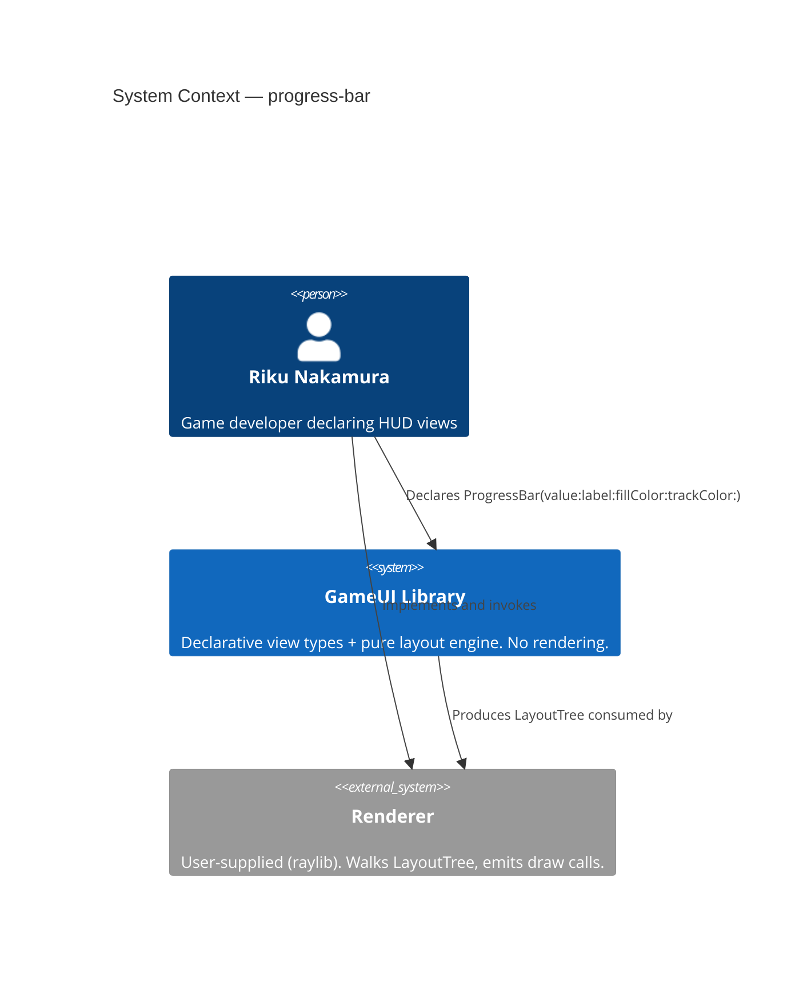
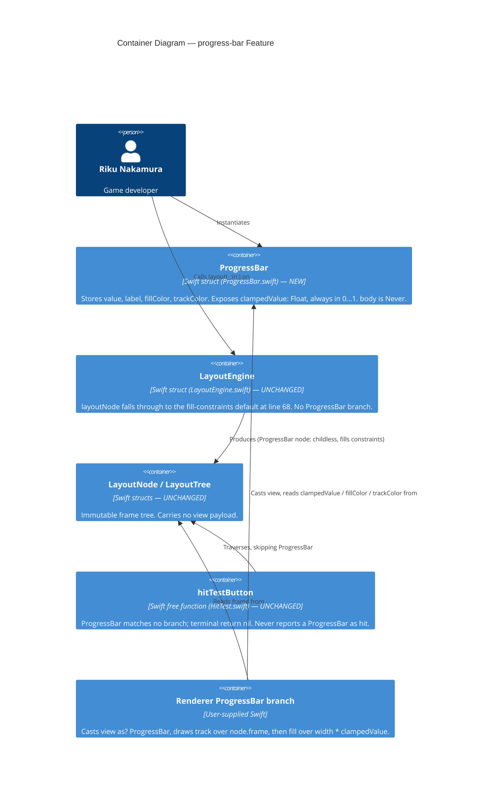

# Feature Delta — progress-bar

> Single narrative file. All wave findings land here as `## Wave: <WAVE> / [REF|WHY|HOW] <Section>` headings.
> Density: `lean` + `ask-intelligent` (per `~/.nwave/global-config.json`).

---

## Wave: DISCUSS / [REF] Pre-requisites

| Dependency | Status | Note |
|---|---|---|
| `View` protocol (`Sources/GameUI/View.swift`) | Merged | `ProgressBar` conforms; `body` is `Never`. |
| `Color` (`Sources/GameUI/Color.swift`) | Merged | Supplies `fillColor` / `trackColor` values and the `.green` / `.darkGray` defaults. |
| `LayoutEngine.layoutNode` default branch (`LayoutEngine.swift:68`) | Merged | Fill-constraints fallback. `ProgressBar` uses it unchanged — same as `Slider` and `Checkbox`. |
| `Slider` (`Sources/GameUI/Slider.swift`) | Merged | Structural precedent. `ProgressBar` is `Slider` minus `onTap`, plus two colors. |
| `.frame(width:height:)` / `HasFrameSize` | Merged | How the game developer sizes a `ProgressBar`. No new sizing mechanism needed. |

No DISCOVER or DIVERGE wave ran for this feature — DISCUSS is the entry wave. No prior-wave assumptions were changed, so there is no `## Changed Assumptions` section.

---

## Wave: DISCUSS / [REF] Persona ID

**Riku Nakamura** — game developer building SpaceSim HUD and loading screens in Swift with GameUI plus a custom (raylib) renderer. Reads layout frames directly, writes his own draw calls, and expects every GameUI view to be a plain immutable value type he can construct inline. SSOT: `docs/product/personas/riku-nakamura.yaml`.

---

## Wave: DISCUSS / [REF] JTBD One-Liner

**JOB-06** — *When I need to show the player how far along something is (shield charge, download, boss health), I want to declare a filled bar with my own colors and no input affordance, so I can communicate progress without hand-drawing two rectangles and reasoning about the fill math in every screen.*

| Dimension | Statement |
|---|---|
| Functional | Convert a `0.0…1.0` magnitude into a declared, layout-participating bar view with a track and a fill. |
| Emotional | Relief — no per-screen geometry math, no fear that a bad value from game state paints outside the bar. |
| Social | The HUD reads as a coherent widget set: `Slider`, `Checkbox`, `ProgressBar` all constructed the same way, so the codebase looks deliberate to collaborators. |

Four forces (compressed): **Push** — every progress indicator today is bespoke `Rectangle` + `.frame` pixel math, duplicated and divergent per screen. **Pull** — one declaration, colors chosen at the call site, renderer draws it. **Anxiety** — "is this just `Slider` with a flag? will it drift from `Slider`?" **Habit** — Riku reaches for `Slider(value:label:)` and ignores the tap callback, accepting a drag handle he does not want.

---

## Wave: DISCUSS / [REF] Locked Decisions

| ID | Decision | Verdict | Rationale |
|---|---|---|---|
| D1 | Feature type | **User-facing** | New public view type in the GameUI declarative surface, visible in every renderer's output. |
| D2 | Walking skeleton | **No** | Brownfield. `Slider`/`Checkbox` establish the leaf-primitive pattern end-to-end; no new architectural spine to prove. |
| D3 | UX research depth | **Lightweight** | Single-step declare→layout→render journey, one persona, well-understood widget. |
| D4 | JTBD analysis | **Yes** | Default. All stories trace to `JOB-06` in `docs/product/jobs.yaml`. |
| D5 | Interaction model | **Display-only** | No `onTap`, no `AnyButton` conformance, no `HitTest.swift` change. "Slider without the drag handle" means no input affordance at all. |
| D6 | Property set | `value`, `label`, `fillColor`, `trackColor` | Colors are declarative so a loading bar, a health bar, and a mana bar differ at the call site rather than by renderer branching on `label`. |
| D7 | Out-of-range values | **Clamped inside `ProgressBar`** | Safety is the project's #1 quality attribute. A single clamped accessor means every renderer author gets the guarantee for free. Diverges from `Slider`, which stores `value` unguarded — deliberate, and noted as a candidate follow-up for `Slider`. |
| D8 | Layout treatment | **No `LayoutEngine` branch** | `ProgressBar` has no children and no intrinsic content size, so the existing fill-constraints default at `LayoutEngine.swift:68` is already correct. Sizing is the caller's `.frame(...)`, exactly as for `Slider`. |
| D9 | Indeterminate state | **Out of scope** | Deferred; see Out-of-Scope. Would require an animation-time contract with the renderer, which no GameUI view currently has. |

---

## Wave: DISCUSS / [REF] Journey — Declare → Layout → Render

Three steps, mirroring the established GameUI journey shape. SSOT: `docs/product/journeys/progress-bar.yaml`.

| # | Step | Action | Emotional entry → exit | Failure modes |
|---|---|---|---|---|
| 1 | Declare | `ProgressBar(value:label:fillColor:trackColor:)` | Curious → Hopeful | `value` out of `0…1`; `value` is NaN; `fillColor == trackColor` (invisible fill — valid, caller's choice) |
| 2 | Layout | `LayoutEngine.layout(view, in: constraints)` | Focused → Verifying | Declared without `.frame(...)` → fills the whole constraint box (expected, matches `Slider`); zero-width constraints |
| 3 | Render | Renderer casts `view as? ProgressBar`, draws track rect then fill rect of width `frame.width * pb.clampedValue` | Hopeful → Confident | Renderer uses raw `value` instead of `clampedValue` → fill overflows the track |

Emotional arc rises monotonically Curious → Hopeful → Confident. Shared artifacts, each with exactly one source: `value` (caller's game state, clamped by `ProgressBar.clampedValue`), `frame.size` (`LayoutEngine` fill-constraints default), `fillColor`/`trackColor` (`ProgressBar` stored properties). No `${variable}` is derived in two places.

---

## Wave: DISCUSS / [REF] Scope Assessment

**PASS.** 2 user stories, 1 bounded context (GameUI leaf views), 1 new file plus test files, ~1.5 days. Zero oversized signals fire: ≤10 stories, 1 module, 0 new integration points, <2 weeks, one user outcome. No split required.

---

## Wave: DISCUSS / [REF] Story Map

**Backbone (single activity):** *Communicate progress in a game screen.*

**Walking skeleton:** Slice 01 — a `ProgressBar` that can be declared, laid out, and drawn at the correct fill width for an in-range value.

| Slice | Stories | Ships | Learning hypothesis |
|---|---|---|---|
| 01 — Declare and Fill | US-01 | `ProgressBar` type + layout participation + render contract | Disproves "a display-only bar needs its own `LayoutEngine` branch" if the fill-constraints default turns out to be wrong for a bar. |
| 02 — Value Safety | US-02 | `clampedValue` boundary guarantee | Disproves "clamping belongs in the renderer" if a single clamped accessor cannot express every out-of-range case (negative, >1, NaN) without a renderer-side guard. |

Taste tests: (a) neither slice ships 4+ components — 01 ships one type, 02 ships one accessor guarantee; (b) no slice depends on a new abstraction; (c) both slices disprove a stated pre-commitment (D8 and D7 respectively); (d) both use real SpaceSim values, not synthetic — see AC; (e) the slices are not scale variants of each other; (f) IN/OUT lists are explicit in each brief. **All taste tests pass.**

Execution order: 01 then 02. Rationale — 01 carries the higher-uncertainty commitment (D8, the no-layout-branch bet) so failing it early is cheap, and 02's clamping guarantee has no observable surface until a bar can be drawn at all. Dogfood moment for each: Riku swaps one bespoke two-`Rectangle` shield-charge indicator for a `ProgressBar` the same day the slice merges.

Slice briefs: `docs/feature/progress-bar/slices/slice-01-declare-and-fill.md`, `slice-02-value-safety.md`.

---

## Wave: DISCUSS / [REF] User Stories with Acceptance Criteria

### US-01 — Declare a Progress Bar with Chosen Colors

`job_id: JOB-06`

As Riku, building the SpaceSim launch screen, I want to declare a progress bar with my own fill and track colors, so the shield-charge indicator communicates its state without me hand-computing two rectangles per screen.

#### Elevator Pitch
Before: Riku cannot express "a bar filled 65% in green on a dark track" — he composes two `Rectangle` views and computes the fill width himself in every screen that needs one.
After: declare `ProgressBar(value: 0.65, label: "Shield charge", fillColor: .green, trackColor: .darkGray)` inside a `.frame(width: 200, height: 20)` → the layout tree returns a node with `frame.size == Size(width: 200, height: 20)`, and the renderer draws a 200×20 `.darkGray` track with a 130×20 `.green` fill from the left edge.
Decision enabled: Riku decides whether the shield-charge readout is legible at HUD scale, and whether that colour pairing survives against the starfield background — by looking at it, not by recomputing pixel math.

**Acceptance Criteria**

- **AC-01** `ProgressBar(value: 0.65, label: "Shield charge", fillColor: .green, trackColor: .darkGray)` constructs successfully and carries `value == 0.65`, `label == "Shield charge"`, `fillColor == .green`, `trackColor == .darkGray`.
- **AC-02** `fillColor` and `trackColor` are optional at the call site: `ProgressBar(value: 0.4, label: "Loading")` constructs and yields `fillColor == .green`, `trackColor == .darkGray`.
- **AC-03** A `ProgressBar` inside `.frame(width: 200, height: 20)`, laid out in constraints `400 × 300`, produces a root layout node with `frame.size == Size(width: 200, height: 20)` and exactly one child. That child is the `ProgressBar`'s own node: `frame.size == Size(width: 200, height: 20)` and zero children of its own. *(Corrected in DESIGN — see `design/upstream-changes.md` UC-01.)*
- **AC-04** A bare `ProgressBar` (no `.frame`) laid out in constraints `400 × 300` produces a node with `frame.size == Size(width: 400, height: 300)` — the same fill-constraints behaviour a bare `Slider` exhibits today.
- **AC-05** For `value == 0.65` in a node of `frame.size.width == 200`, the renderer-facing fill width `frame.size.width * pb.clampedValue` equals `130.0`.
- **AC-06** `ProgressBar` is not reachable by `hitTestButton(view:node:at:)`: a `ProgressBar` at any point in a laid-out tree returns `nil` (it is not an `AnyButton`, and no tap callback exists to invoke).
- **AC-07** `ProgressBar` is a `View` whose `body` is `Never`, consistent with `Slider`, `Checkbox`, and `Text`.

### US-02 — Trust Any Value From Game State

`job_id: JOB-06`

As Riku, wiring the progress bar directly to live game state, I want out-of-range values to be clamped by the view itself, so a mid-frame `shieldCharge` of `1.4` or `-0.2` never paints fill outside the track.

#### Elevator Pitch
Before: Riku cannot pass raw game state to a progress indicator — `shieldCharge` briefly exceeds `1.0` during a recharge burst and his hand-rolled fill rectangle paints past the track edge onto the portrait beside it.
After: declare `ProgressBar(value: gameState.shieldCharge, label: "Shield charge")` with `shieldCharge == 1.4` → the renderer reads `clampedValue == 1.0` and draws a fill exactly as wide as the track, never wider.
Decision enabled: Riku decides he can bind the bar straight to live game state and delete his defensive `min(max(...))` wrapper at the call site.

**Acceptance Criteria**

- **AC-08** `ProgressBar(value: 1.4, label: "Shield charge").clampedValue == 1.0`.
- **AC-09** `ProgressBar(value: -0.2, label: "Shield charge").clampedValue == 0.0`.
- **AC-10** `ProgressBar(value: Float.nan, label: "Shield charge").clampedValue == 0.0` — NaN resolves to empty, not to a crash and not to a full bar.
- **AC-11** `ProgressBar(value: Float.infinity, ...).clampedValue == 1.0` and `ProgressBar(value: -Float.infinity, ...).clampedValue == 0.0`.
- **AC-12** For any `Float` input whatsoever, `clampedValue` lies in `0.0...1.0` inclusive — stated and verified as a property, not only at the listed points.
- **AC-13** For in-range inputs, `clampedValue == value` exactly: `ProgressBar(value: 0.65, ...).clampedValue == 0.65`, and the same holds at both endpoints `0.0` and `1.0`.
- **AC-14** `value` remains readable verbatim as declared — `ProgressBar(value: 1.4, ...).value == 1.4` — so clamping is a rendering guarantee, not silent data loss.

Requirements completeness: **0.97** (14 AC across 2 stories; every journey step and every documented failure mode has at least one covering AC; the one uncovered item is renderer-side draw-call emission, which is out of GameUI's boundary by design).

---

## Wave: DISCUSS / [REF] Driving Ports

GameUI is a library, not an application — the driving port is the **Swift public API surface** of the `GameUI` module:

| Port | Surface | New in this feature |
|---|---|---|
| Declaration | `ProgressBar.init(value:label:fillColor:trackColor:)` | Yes |
| Layout | `LayoutEngine.layout(_:in:)` | No — existing entry point, unchanged |
| Render contract | `view as? ProgressBar` → read `clampedValue`, `fillColor`, `trackColor` + `node.frame` | Yes (documented contract, no code in this repo) |

No CLI, no HTTP, no skill surface.

---

## Wave: DISCUSS / [REF] Outcome KPIs

| ID | KPI | Target | Measurement |
|---|---|---|---|
| KPI-1 | US-01 acceptance scenarios green | 100% (AC-01…AC-07) | `swift test` at Slice 01 merge |
| KPI-2 | Out-of-range inputs producing a fill wider than the track | 0 across all AC-08…AC-14 cases plus the property test | `swift test` at Slice 02 merge |
| KPI-3 | Lines of geometry math a renderer author writes to draw the bar | ≤ 3 (track rect, fill width, fill rect) | Count in the documented renderer snippet in the DESIGN wave's renderer contract |
| KPI-4 | Existing suite regressions | 0 | Full `swift test` green; no existing test file modified |
| ~~KPI-5~~ | ~~Bespoke two-`Rectangle` progress indicators remaining in the consuming game~~ | — | **WITHDRAWN as a GameUI KPI** (Forge, HIGH). It measures adoption inside SpaceSim, a separate repo GameUI has no visibility into, with no measurement protocol or handoff contract. Reclassified as a *collaboration outcome* owned by the game team: "one shield-charge indicator converted from two-`Rectangle` to `ProgressBar` at Slice 01 merge", tracked in the game project, not here. KPI-1…KPI-4 remain and are all measurable via `swift test`. |

---

## Wave: DISCUSS / [REF] Definition of Done

1. - [ ] `ProgressBar` exists in `Sources/GameUI/ProgressBar.swift`, `public struct`, conforms to `View`, `body: Never`
2. - [ ] All 14 AC covered by Swift Testing tests using backtick-quoted function names (per `CLAUDE.md`)
3. - [ ] Property-based coverage for AC-12 (`clampedValue` in `0…1` for arbitrary `Float`)
4. - [ ] No `import Foundation` anywhere in the new file
5. - [ ] `Float` geometry only; no `CGFloat`, no `Double`
6. - [ ] No new protocol, no `LayoutEngine` branch, no `HitTest.swift` change (D5, D8 upheld)
7. - [ ] Full existing suite green with zero existing test files modified
8. - [ ] Renderer contract documented (how to draw track + fill from `clampedValue` and `node.frame`)
9. - [ ] SSOT updated: `docs/product/jobs.yaml`, `docs/product/journeys/progress-bar.yaml`, `docs/product/personas/riku-nakamura.yaml`

---

## Wave: DISCUSS / [REF] Definition of Ready Validation

| DoR Item | US-01 | US-02 | Evidence |
|---|---|---|---|
| Problem statement clear, domain language | PASS | PASS | "hand-computing two rectangles per screen"; "fill outside the track". Domain terms: track, fill, shield charge, HUD. |
| Persona with specific characteristics | PASS | PASS | Riku Nakamura — SpaceSim HUD developer, custom raylib renderer, reads frames directly. |
| 3+ domain examples with real data | PASS | PASS | US-01: shield charge 0.65 green-on-darkGray, loading bar defaults, bare bar in 400×300. US-02: 1.4 recharge burst, -0.2, NaN, ±infinity. |
| UAT scenarios in Given/When/Then (3–7) | ~~PASS~~ **CONDITIONAL** | ~~PASS~~ **CONDITIONAL** | *Corrected after review (Eclipse, LOW).* The original row asserted "5 scenarios for US-01, 4 for US-02, rendered on request via `gherkin-scenarios`" — but that Tier-2 expansion was never rendered in lean mode, so DoR was claimed against an artifact that does not exist. The scenarios were in fact elaborated in DISTILL as 20 executable `swift-testing` tests covering all 14 AC (see DISTILL § Scenario List). The item is satisfied in substance; it was not satisfied at the time DISCUSS asserted it. |
| AC derived from UAT | PASS | PASS | AC-01…AC-07 ← US-01 scenarios; AC-08…AC-14 ← US-02 scenarios. All observable (property values, frame sizes, computed widths). |
| Right-sized (1–3 days, 3–7 scenarios) | PASS | PASS | US-01 ≈1 day / 5 scenarios; US-02 ≈0.5 day / 4 scenarios. |
| Technical notes: constraints/dependencies | PASS | PASS | D7 (clamp diverges from `Slider`), D8 (no layout branch, uses `LayoutEngine.swift:68`), NaN ordering caveat noted in Slice 02 brief. |
| Dependencies resolved or tracked | PASS | PASS | `View`, `Color`, `LayoutEngine` default branch all merged. US-02 depends on US-01, tracked in slice order. |
| Outcome KPIs with measurable targets | ~~PASS~~ **CONDITIONAL** | ~~PASS~~ **CONDITIONAL** | *Corrected after review.* KPI-1 (US-01) and KPI-2 (US-02) are numeric with named measurement methods and stand. KPI-5 did **not** meet "measurable target" and has been withdrawn — see the KPI table above. |

**DoR Status: PASSED (7/9 clean, 2 conditional), both stories.**

Two items were downgraded from PASS after the Final Wave Review Gate. Neither blocks DELIVER — the substance is satisfied — but the original 9/9 claim was overstated and is corrected here rather than quietly amended. Note that Eclipse's review validated this checklist as "8/8", having silently dropped the KPI item; the gap was caught only by combining Eclipse's scope with Forge's independent KPI-5 finding.

Anti-pattern review: no "Implement-X" titles; no generic data (real SpaceSim values throughout); no technical AC (all state observable values, none prescribe `min`/`max` or a file layout); no oversized stories; no abstract requirements. Slice composition gate: both slices contain a user-visible value story; zero `@infrastructure`-only slices.

---

## Wave: DISCUSS / [REF] Out of Scope

- **Indeterminate / unknown-duration bars** (D9) — needs an animation-time contract with the renderer that GameUI does not currently have for any view.
- **Percentage or value text drawn inside the bar** — the caller composes a `Text` in a `ZStack` today; no new mechanism needed.
- **Segmented / stepped bars** (e.g. 5 discrete pips).
- **Vertical orientation** — horizontal only.
- **Animation or easing between values** — the caller re-declares with a new `value` each frame.
- **Click-to-seek** — explicitly excluded by D5. Reintroducing it means adding `onTap` and a `HitTest.swift` branch, which is a separate feature.
- **Retrofitting clamping onto `Slider`** — noted as a follow-up candidate under D7, not delivered here.

---

## Wave: DISCUSS / [REF] Wave Decisions Summary

**Key decisions:** D1 user-facing · D2 no walking skeleton (brownfield) · D3 lightweight research · D4 JTBD on · D5 display-only, no `onTap` · D6 four properties incl. two colors · D7 clamp inside the view · D8 no `LayoutEngine` branch · D9 indeterminate deferred. Full table above.

**Requirements summary:** Riku needs a declarative, display-only horizontal bar that turns a `0…1` magnitude into a track plus a proportional fill, with colors chosen at the call site, safe against any `Float` the game state produces. Two thin slices: the type and its fill behaviour, then the value-safety guarantee.

**Constraints established:** Swift 6.2 · no Foundation · `Float` geometry only · Swift Testing with backtick-quoted names · value types only · no new protocols · no `LayoutEngine` or `HitTest` changes · `ProgressBar` sizes via the existing fill-constraints default and the caller's `.frame(...)`.

**Upstream changes:** none — DISCUSS is the entry wave for this feature.

**Handoff:** → `nw-solution-architect` (DESIGN, full artifact set) and `nw-platform-architect` (DEVOPS, KPIs only). The single open question for DESIGN is the exact shape of the renderer contract for `clampedValue` + `frame` → two draw calls, and whether `clampedValue` is a stored-at-init or computed property.

---

## Wave: DESIGN / [REF] Decisions

Scope: **Application / components** (@nw-solution-architect). Mode: **propose**. Paradigm: **OOP / protocol-oriented value types**, inherited from `CLAUDE.md` — unchanged, no write-back needed.

| ID | Decision | Verdict |
|---|---|---|
| DDD-1 | File placement | New file `Sources/GameUI/ProgressBar.swift` |
| DDD-2 | Type shape | One `public struct ProgressBar: View`, `body: Never`. No new protocol. |
| DDD-3 | `clampedValue` | Computed property, NaN-safe by negated comparison (resolves ODQ-PB-01) |
| DDD-4 | Layout dispatch | **No `LayoutEngine` branch.** Reuses the fill-constraints default at `LayoutEngine.swift:68` |
| DDD-5 | Hit-test | **No `HitTest.swift` change.** `ProgressBar` matches no branch and falls to the terminal `return nil` |
| DDD-6 | Relationship to `Slider` | CREATE NEW, not EXTEND. `Slider` is not generalised, not unified, not touched. ADR-005. |
| DDD-7 | Colour defaults | `fillColor: Color = .green`, `trackColor: Color = .darkGray` as init default arguments |
| DDD-8 | Renderer contract | Two ordered draw calls — track over `node.frame`, then fill over the left `clampedValue` fraction |

---

## Wave: DESIGN / [REF] Component Decomposition

| Component | Path | Change type |
|---|---|---|
| `ProgressBar` struct | `Sources/GameUI/ProgressBar.swift` | **CREATE NEW** (new file, new type) |
| `layoutNode` fill-constraints default | `Sources/GameUI/LayoutEngine.swift:68` | **NO CHANGE** — reused as-is |
| `hitTestNode` terminal `return nil` | `Sources/GameUI/HitTest.swift:60` | **NO CHANGE** — reused as-is |
| `Color` + `.green` / `.darkGray` | `Sources/GameUI/Color.swift` | **NO CHANGE** — reused for defaults |
| `View` protocol conformance | `Sources/GameUI/View.swift` | **NO CHANGE** |
| Renderer `ProgressBar` branch | User-supplied renderer | **CONTRACT ONLY** — specified below, no code in this repo |
| `ProgressBar` tests | `Tests/GameUITests/acceptance/` | **CREATE NEW** |

Total production change surface: **one new file**. No existing source file is modified — the strongest possible form of the "no regression" guarantee in DoD item 7.

---

## Wave: DESIGN / [REF] Driving Ports

GameUI is a library; the driving port is the Swift public API of the `GameUI` module.

| Port | Signature | New |
|---|---|---|
| Declaration | `ProgressBar.init(value: Float, label: String, fillColor: Color = .green, trackColor: Color = .darkGray)` | Yes |
| Fill query | `ProgressBar.clampedValue: Float` — computed, always in `0.0...1.0` | Yes |
| Declared value | `ProgressBar.value: Float` — verbatim as passed (AC-14) | Yes |
| Layout | `LayoutEngine.layout(_:in:) -> LayoutTree` | No — existing, unchanged |

## Wave: DESIGN / [REF] Driven Ports + Adapters

**None.** `ProgressBar` performs no I/O, holds no reference, and calls nothing. The renderer is not a driven port: GameUI does not invoke it. GameUI produces a `LayoutTree` value and the renderer independently consumes it, exactly as for every other view type. There is no outbound side-effect to adapt.

The only injected dependency anywhere in the layout path is `LayoutEngine.textMeasurer`, and `ProgressBar` does not use it — it has no text to measure. `label` is metadata for the renderer, not a layout input.

---

## Wave: DESIGN / [REF] Reuse Analysis

| Existing Component | File | Overlap | Decision | Justification |
|---|---|---|---|---|
| `Slider` | `Sources/GameUI/Slider.swift` | `value: Float` in 0…1 + `label`; a bar with a proportional fill | **CREATE NEW** | See ADR-005. The distinguishing operation is `onTap` — invoking it changes observable behaviour, so the two types are not substitutable even as immutable values. Unifying forces `ProgressBar` to carry a meaningless callback (violating DISCUSS D5) and forces every renderer to branch on a mode flag. ADR-003's square/rectangle unification test is applied and **fails** here, in contrast to padding. |
| `layoutNode` fill-constraints default | `LayoutEngine.swift:68` | Produces a childless node filling the constraint box | **REUSE AS-IS** | Already the exact required behaviour. `ProgressBar.body` is `Never`, so the composite-body branch at line 65 is skipped and dispatch falls through to line 68. Adding a branch would duplicate the default. Confirms DISCUSS D8. |
| `hitTestNode` | `HitTest.swift` | Traversal that must not reach `ProgressBar` | **REUSE AS-IS** | `ProgressBar` is not `AnyButton`/`ContainerView`/`ZStackView`/`HasFrameSize`/`AnyDirectionalPaddingModifier`, so it hits the terminal `return nil` at line 60. AC-06 is satisfied structurally by the *absence* of code, and stays satisfied as long as no protocol conformance is added. |
| `Rectangle` | `LeafViews.swift` | A coloured rect — a track and a fill are each one | **CREATE NEW** | Composing two `Rectangle`s in a `ZStack` is precisely the workaround JOB-06 exists to eliminate: it puts the fill-width arithmetic back at the call site, which is the push force. |
| `Checkbox` | `Sources/GameUI/Checkbox.swift` | Leaf primitive, own file, no `LayoutEngine` branch | **REUSE AS PATTERN** | Structural template only. No shared code — no protocol, no base type. |
| `Color` | `Sources/GameUI/Color.swift` | Colour values incl. `.green`, `.darkGray` | **REUSE AS-IS** | Palette already carries both defaults. No new colour constants. |
| `WrappedText.clippedLines` | `WrappedText.swift` | A pure derived accessor read by the renderer | **REUSE AS PATTERN** | `clampedValue` is the same shape of contract — pure, deterministic, owned by the type that owns the data (ADR-001/ADR-004 lineage). No shared code. |

Zero unjustified CREATE NEW decisions. The one contestable row (`Slider`) is escalated to ADR-005 with the counter-argument stated and answered.

---

## Wave: DESIGN / [REF] Technology Choices

| Choice | Version / Detail | Rationale |
|---|---|---|
| Swift | 6.2 | Matches every existing source file. `ProgressBar` is a frozen-shape value type; no concurrency annotations needed beyond `View` conformance. |
| `Float` geometry | Existing `Size`, `Rect`, `Point` | No Foundation, no `CGFloat`. `value` and `clampedValue` are `Float` for the same reason. |
| No Foundation | — | `clampedValue` uses only comparison operators. Notably it does **not** use `min`/`max`, which would propagate NaN. |
| Swift Testing | Existing | Backtick-quoted test names per `CLAUDE.md`. |

No third-party dependencies. No new target, module, or build phase.

---

## Wave: DESIGN / [REF] C4 System Context



## Wave: DESIGN / [REF] C4 Container Diagram



No C4 Component diagram is produced: the feature has one component with no internal structure to decompose.

---

## Wave: DESIGN / [REF] Renderer Contract

`ProgressBar` guarantees to any renderer:

| Guarantee | Detail |
|---|---|
| `clampedValue ∈ 0.0...1.0` | For **every** `Float` input including NaN and ±infinity. NaN → `0.0`. |
| `clampedValue == value` for in-range input | Exact, including both endpoints. No epsilon drift. |
| Purity / determinism | Same instance always yields the same `clampedValue`. Safe to read many times per frame. |
| Childless node | The `ProgressBar`'s own `LayoutNode` has `children.isEmpty == true`. |
| Never hit-tested | `hitTestButton` never returns an index attributable to a `ProgressBar`. |

The renderer branch, in full:

```
if let pb = view as? ProgressBar {
    draw(rect: node.frame, color: pb.trackColor)
    let fillWidth = node.frame.size.width * pb.clampedValue
    draw(rect: Rect(origin: node.frame.origin,
                    size: Size(width: fillWidth, height: node.frame.size.height)),
         color: pb.fillColor)
    return
}
```

Three lines of geometry — satisfies KPI-3 (≤3). Draw order is **track first, then fill**: reversing it hides the fill. The renderer must read `clampedValue`, never `value`; reading `value` reintroduces the overflow that JOB-06 exists to prevent. `label` is available to renderers that draw a caption, and is ignored by those that do not.

---

## Wave: DESIGN / [REF] Open Questions

| ID | Question | Deferred to | Note |
|---|---|---|---|
| ODQ-PB-01 | Computed vs init-clamped `clampedValue` | **RESOLVED in DESIGN** (DDD-3) | Computed. Satisfies AC-14 structurally. |
| ODQ-PB-02 | Should the AC-12 property test enumerate special `Float` values or use a random generator? | DISTILL | Swift Testing has no built-in property runner. Suggested: parametrized `@Test(arguments:)` over a curated special-value set plus a bounded random sweep. Acceptance designer's call. |
| ODQ-PB-03 | Does `Slider` get the same clamping treatment? | Future feature | Out of scope per DISCUSS. ADR-005 records the inconsistency as accepted, deliberate, and time-boxed to this feature. |

---

## Wave: DESIGN / [REF] Wave Decisions Summary

**Architecture summary.** Pattern: leaf-primitive value type inside the existing modular library — no new layer, no new protocol, no dispatch branch. Paradigm: OOP / protocol-oriented value types (unchanged from `CLAUDE.md`). Key components: `ProgressBar` (new, one file) plus a documented renderer contract; everything else is reuse-as-is.

**Constraints established.** `ProgressBar` must not conform to `AnyButton`, `ContainerView`, `ZStackView`, `HasFrameSize`, or `AnyDirectionalPaddingModifier` — any of these silently changes both layout and hit-test behaviour and breaks AC-04 and AC-06. `clampedValue` must not be implemented with `min`/`max`, which propagate NaN and would break AC-10. Draw order in the renderer contract is normative, not stylistic.

**Upstream changes.** One: AC-03 corrected (`docs/feature/progress-bar/design/upstream-changes.md`, UC-01).

**Outcome collision check.** `nwave-ai outcomes check-delta` → exit `0`. The project has no `docs/product/outcomes/registry.yaml`, so the check is vacuous rather than confirmatory — recorded here so DEVOPS does not read it as a positive signal.

**Handoff.** → `nw-platform-architect` (DEVOPS). Package: this feature-delta, ADR-005, `docs/product/architecture/brief.md` § progress-bar Feature, and the KPI table from DISCUSS.

---

## Wave: DISTILL / [REF] Pre-requisites

| Dependency | Source | Status |
|---|---|---|
| Driving ports (`ProgressBar.init`, `LayoutEngine.layout`, `clampedValue`, `hitTestButton`) | DESIGN § Driving Ports | Available |
| ATDD infrastructure policy | `docs/architecture/atdd-infrastructure-policy.md` | **Bootstrapped this wave** (was absent) |
| DEVOPS environment matrix | — | **Absent — WARN.** Defaults applied. GameUI is a library: no deploy target, no environment matrix. Non-blocking. |
| Deliverable type | `.nwave/des-config.json` + global config | Unset in both → resolves to `application`. No plugin/skill reviewer routing. |

**Reconciliation: PASSED — 0 contradictions.** DISCUSS D1–D9 checked against DESIGN DDD-1–8. D5/D8 are upheld by DDD-4/DDD-5; DDD-3 resolves ODQ-PB-01 rather than contradicting it. The single genuine conflict (AC-03) was caught in DESIGN and back-propagated via `design/upstream-changes.md` UC-01 before scenarios were written.

---

## Wave: DISTILL / [REF] Test Placement

`Tests/GameUITests/acceptance/ProgressBarSlice{1,2}*.swift` — one file per slice, matching the established convention (`WrappedTextMaxLinesSlice1CoreTests.swift`, `WrappedTextSlice2RobustnessTests.swift`, …). Header comment names the driving ports; a section comment precedes each AC group.

**Deviation from the DISTILL skill, recorded deliberately.** No `.feature` files, no step definitions, no `domain_types.py`, no Tier-B state machine. This project has no Gherkin runner and `CLAUDE.md` forbids third-party dependencies, so `swift-testing` with backtick-quoted names is the only executable form available. Mandate-12's step-reuse ratio is undefined without step decorators and is not reported. The `.swift` test files are the scenario SSOT in place of `.feature` files.

---

## Wave: DISTILL / [REF] Scenario List

20 tests across 2 suites. No `@skip` markers — Swift Testing has no pending state in use here, and the RED classification below distinguishes the sets precisely.

| # | Test | AC | Tags |
|---|---|---|---|
| 1 | `ProgressBar carries value label fillColor and trackColor as declared` | AC-01 | `@US-01` `@in-memory` |
| 2 | `ProgressBar declared without colours defaults to green fill on darkGray track` | AC-02 | `@US-01` `@in-memory` |
| 3 | `framed ProgressBar is sized by its frame and the bar node itself has no children` | AC-03 | `@US-01` `@walking_skeleton` `@driving_port` |
| 4 | `bare ProgressBar fills the whole constraint box and has no children` | AC-04 | `@US-01` `@driving_port` |
| 5 | `bare ProgressBar lays out identically to a bare Slider` | AC-04b | `@US-01` `@characterization` |
| 6 | `fill width for a 65 percent bar in a 200 wide node is 130` | AC-05 | `@US-01` `@walking_skeleton` `@driving_port` |
| 7 | `full bar fill width equals track width and empty bar fill width is zero` | AC-05b | `@US-01` `@error` |
| 8 | `hit testing a ProgressBar returns nil at every point including its own frame` | AC-06 | `@US-01` `@driving_port` |
| 9 | `a ProgressBar beside a Button does not consume a hit-test index` | AC-06b | `@US-01` `@characterization` |
| 10 | `ProgressBar is a primitive view whose Body is Never` | AC-07 | `@US-01` |
| 11 | `a shield charge of 1 point 4 clamps to a full bar` | AC-08 | `@US-02` `@error` |
| 12 | `a shield charge of minus 0 point 2 clamps to an empty bar` | AC-09 | `@US-02` `@error` |
| 13 | `a NaN shield charge resolves to an empty bar rather than crashing or filling` | AC-10 | `@US-02` `@error` |
| 14 | `positive infinity fills the bar and negative infinity empties it` | AC-11 | `@US-02` `@error` |
| 15 | `clamped value lies within zero and one for every special float` (23 cases) | AC-12 | `@US-02` `@property` `@error` |
| 16 | `clamped value lies within zero and one across a seeded sweep of the whole float domain` | AC-12 | `@US-02` `@property` |
| 17 | `fill width never exceeds track width across a seeded sweep of the whole float domain` | AC-12b | `@US-02` `@property` |
| 18 | `clamped value is the same on repeated reads` (23 cases) | AC-12c | `@US-02` `@property` |
| 19 | `an in-range shield charge passes through unchanged` (5 cases) | AC-13 | `@US-02` |
| 20 | `an out-of-range shield charge is still readable as declared` (3 cases) | AC-14 | `@US-02` |

**Error/edge-case share: 9 of 20 (45%)** — above the 40% target.

**Walking skeleton** — tests 3 and 6: declare a `ProgressBar` at real HUD geometry, run the real `LayoutEngine`, and read back the exact fill width a renderer would draw. Litmus test met: *"a bar declared at 200×20 with a 65% shield charge yields a 130-point green fill"* is a sentence Riku can confirm without reading code.

**ODQ-PB-02 resolved.** AC-12 is expressed as a property two ways: a curated 23-value special set (`0`, `±0`, `1`, `1±ulp`, `±∞`, `NaN`, `signalingNaN`, subnormals, `greatestFiniteMagnitude`, …) and a 4096-value sweep over raw `Float` bit patterns via an in-repo seeded SplitMix64 — stdlib only, no Foundation, no third-party PBT library. Fixed seeds (`0xC0FFEE`, `0x5EED`) make any counterexample exactly reproducible, and the sweeps report the **first** counterexample rather than all 4096.

---

## Wave: DISTILL / [REF] Driving Adapter Coverage

| Driving port (DESIGN) | Covered by | Protocol |
|---|---|---|
| `ProgressBar.init(value:label:fillColor:trackColor:)` | tests 1, 2 | Direct construction |
| `LayoutEngine.layout(_:in:)` | tests 3, 4, 5, 6 | Direct in-process call |
| `ProgressBar.clampedValue` | tests 6–8, 11–19 | Direct call (the renderer's real read path) |
| `ProgressBar.value` | tests 1, 20 | Direct read |
| `hitTestButton(view:node:at:)` | tests 8, 9 | Direct in-process call |

Zero uncovered entry points. There is no CLI, HTTP endpoint, or hook in this feature — the library's public API *is* the user's invocation path, so a direct call is the real protocol, not a shortcut past one.

## Wave: DISTILL / [REF] Adapter Coverage (Mandate 6)

| Adapter | `@real-io` scenario | Covered by |
|---|---|---|
| — | N/A | GameUI has **no driven adapters**. Established in DESIGN § Driven Ports: the library performs no I/O, holds no reference type, and calls nothing outbound. The renderer is not a port — GameUI never invokes it. Zero "NO — MISSING" rows possible. |

## Wave: DISTILL / [REF] Scaffolds (Mandate 7)

| File | Marker | Fails via |
|---|---|---|
| `Sources/GameUI/ProgressBar.swift` | `let __SCAFFOLD__ = true` | `clampedValue` returns `.nan` |

Swift is compiled, so a scaffold must build or the suite classifies BROKEN rather than RED: stored properties, the initialiser and `body` are therefore real. Only the feature's genuinely new behaviour — the clamp — is scaffolded. `.nan` was chosen over `fatalError` deliberately: a trap would abort the whole test process, whereas `.nan` fails every equality and range assertion cleanly as an assertion failure.

Detection: `grep -rn "__SCAFFOLD__" Sources/`. Zero markers must remain after DELIVER.

---

## Wave: DISTILL / [REF] Registered Outcomes

| OUT-id | Kind | Contract |
|---|---|---|
| **OUT-1** | `operation` | Declare a display-only progress bar with caller-chosen colours → `ProgressBar` view + childless constraint-filling layout node |
| **OUT-2** | `invariant` | `clampedValue ∈ 0.0...1.0` for every `Float` (NaN → `0.0`); identity for in-range input |

Registry: `docs/product/outcomes/registry.yaml`. Written by hand — `nwave-ai outcomes register` is broken in nwave-ai 3.13.0 (`_SCHEMA_PATH` resolves to `<site-packages>/docs/product/outcomes/schema.json`, which is not shipped; every invocation raises `FileNotFoundError`). `outcomes check-delta` is unaffected and passes.

---

## Wave: DISTILL / [REF] RED Gate Result

**PASSED — handoff to DELIVER is not blocked.** Detail: `docs/feature/progress-bar/distill/red-classification.md`.

- 20 tests: **11 failing, all `MISSING_FUNCTIONALITY`**; zero `IMPORT_ERROR` / `FIXTURE_BROKEN` / `SETUP_FAILURE` / `WRONG_ASSERTION`.
- Full suite **175 tests, 62 issues, all 62 in the new suites** — zero regressions in the 155 pre-existing tests.
- **9 tests pass at DISTILL time** (`ALREADY_SATISFIED_BY_REUSE`) — the direct consequence of DDD-4/DDD-5 deciding layout and hit-test behaviour by reuse. Once the type exists, that behaviour is already correct.

**Slice 01's learning hypothesis is answered, and it holds.** The no-`LayoutEngine`-branch bet (D8/DDD-4) is confirmed with zero new layout code. The consequence for planning: Slice 01 retains almost no TDD content — only AC-05/AC-05b, which depend on `clampedValue`, i.e. Slice 02's work. **The two slices have effectively collapsed into one.** DELIVER should plan a single cycle implementing `clampedValue`, after which all 20 tests go green together.

---

## Wave: DISTILL / [REF] Final Wave Review Gate

**DISPATCHED 2026-07-22 — four reviewers in parallel on Haiku. GATE PASSED.**

| Reviewer | Scope | Verdict | Blocker / High / Low |
|---|---|---|---|
| Eclipse (`nw-product-owner-reviewer`) | DISCUSS | approved | 0 / 0 / 2 |
| Architect (`nw-solution-architect-reviewer`) | DESIGN | approved | 0 / 0 / 0 |
| Forge (`nw-platform-architect-reviewer`) | DEVOPS skip justification | conditionally_approved | 0 / 2 / 1 |
| Sentinel (`nw-acceptance-designer-reviewer`) | DISTILL | approved | 0 / 0 / 0 |

Zero blockers. Handoff to DELIVER is unblocked.

### Findings and disposition

| # | Sev | Source | Finding | Disposition |
|---|---|---|---|---|
| F-1 | HIGH | Forge | `brief.md` names "Linux CI catches any inadvertent `import Foundation`" as the enforcement mechanism in **five** feature sections, but this repo has no CI at all — no `.github/workflows/`, no `.gitlab-ci.yml`, no `.circleci`, no `Jenkinsfile`. The no-Foundation and `Float`-only constraints are enforced by code review alone. Verified independently. | **OPEN — repo-wide, pre-dates this feature.** Not fixed here: it affects four other features' records and setting up CI is a separate decision. See § Open Items. |
| F-2 | HIGH | Forge | KPI-5 measures adoption inside SpaceSim, a repo GameUI cannot observe. | **FIXED** — withdrawn as a GameUI KPI, reclassified as a game-team collaboration outcome. |
| F-3 | LOW | Eclipse | AC-03's original architectural error shows DISCUSS did not check AC feasibility against the layout dispatch. | **ACCEPTED — process note.** Future DISCUSS waves should validate each AC against dispatch behaviour before asserting DoR. |
| F-4 | LOW | Eclipse | DoR asserted Given/When/Then scenarios that were never rendered (`gherkin-scenarios` is a lean-mode Tier-2 expansion). | **FIXED** — DoR row downgraded to CONDITIONAL with the real provenance stated. |
| F-5 | LOW | Forge | `swift test` required the SwiftPM sandbox disabled in this environment; may hide issues on a CI runner. | **ACCEPTED** — folded into F-1; verify with the sandbox enabled once CI exists. |

**Synthesis finding, not attributable to any single reviewer.** Eclipse validated the DoR checklist as "8/8" — it has **nine** items, and the one silently dropped was "Outcome KPIs defined with measurable targets", precisely the item Forge independently found broken via KPI-5. Neither reviewer caught it alone. DoR is now recorded as 7/9 clean + 2 conditional rather than the original 9/9.

**Correction to a reviewer recommendation.** Forge proposed a CI check of the form `grep -rn "import Foundation" Sources/` "must exit 0". That is inverted — `grep` exits `0` when it *finds* matches. The gate must fail on exit `0` and pass on exit `1`.

### Open items carried to DELIVER

- **F-1 (CI):** the architecture leans on a gate that does not exist. Until CI is established, treat "Linux CI catches it" in `brief.md` as aspirational across all five features that claim it. Either stand up CI, or correct the enforcement column to say "code review".

---

## Wave: DELIVER / [REF] Pre-requisites

| Dependency | Source | Status |
|---|---|---|
| 20 acceptance tests + RED scaffold | DISTILL | Consumed unchanged; no test file modified (DoD item 7) |
| Component decomposition (1 CREATE NEW, 5 NO CHANGE) | DESIGN | Honoured exactly |
| ADR-005 Decision 2 clamp | `adr-005-progressbar-slider-separation.md` | Implemented verbatim |
| Environment matrix | DEVOPS — not run | Defaults; library has no environment matrix |

## Wave: DELIVER / [REF] Implementation Summary

Replaced the RED-scaffold body of `ProgressBar.clampedValue` (`.nan`) with the NaN-safe negated-comparison clamp from ADR-005 Decision 2, and deleted the `__SCAFFOLD__` marker. One step (`01-01`), one production file, three lines of logic. No other source file was touched — the layout and hit-test behaviour asserted by nine of the twenty tests comes entirely from existing code paths (`LayoutEngine.swift:68`, `HitTest.swift` terminal `return nil`), exactly as DDD-4/DDD-5 designed.

## Wave: DELIVER / [REF] Files Modified

**Production**
- `Sources/GameUI/ProgressBar.swift` — `clampedValue` implemented; `__SCAFFOLD__` marker and scaffold comment block removed

**Tests** (authored by DISTILL, committed with this step; content unmodified)
- `Tests/GameUITests/acceptance/ProgressBarSlice1DeclareAndFillTests.swift`
- `Tests/GameUITests/acceptance/ProgressBarSlice2ValueSafetyTests.swift`

Commit `23fd197` — 3 files, 365 insertions. Trailers `Step-Id: 01-01`, `Task-Id: progress-bar`.

## Wave: DELIVER / [REF] Scenarios Green

**20 of 20** ProgressBar tests green. **Full suite: 175 tests in 30 suites, 0 issues** (2026-07-22). Zero regressions in the 155 pre-existing tests.

## Wave: DELIVER / [REF] Demo Evidence

Phase 3.5 gate. This is a library with no CLI, so the Elevator Pitch "After" lines were executed against the real compiled `GameUI` module outside the test harness (`swiftc` against `GameUI.build/*.o`), not through a subprocess. Captured stdout, exit code 0:

```
=== US-01 — Declare a Progress Bar with Chosen Colors ===
layout node frame.size = Size(width: 200.0, height: 20.0)
track: 200.0x20.0 trackColor=Color(r: 80, g: 80, b: 80, a: 255)
fill : 130.0x20.0 fillColor=Color(r: 96, g: 186, b: 112, a: 255)
hitTestButton at centre = nil

=== US-02 — Trust Any Value From Game State ===
shieldCharge=1.4 -> value=1.4 clampedValue=1.0 fillWidth=200.0 (track=200.0)
shieldCharge=-0.2 -> value=-0.2 clampedValue=0.0 fillWidth=0.0 (track=200.0)
shieldCharge=nan -> value=nan clampedValue=0.0 fillWidth=0.0 (track=200.0)
shieldCharge=0.65 -> value=0.65 clampedValue=0.65 fillWidth=130.0 (track=200.0)
```

US-01 promised "a 200×20 `.darkGray` track with a 130×20 `.green` fill" — delivered exactly. US-02 promised "the renderer reads `clampedValue == 1.0` and draws a fill exactly as wide as the track" — delivered, and the `value=1.4 / clampedValue=1.0` pair makes AC-14 visible: clamping is a render guarantee, not data loss.

## Wave: DELIVER / [REF] DoD Check

| # | Item | Result |
|---|---|---|
| 1 | `ProgressBar` in `Sources/GameUI/ProgressBar.swift`, `public struct`, `View`, `body: Never` | PASS |
| 2 | All 14 AC covered by backtick-named Swift Testing tests | PASS — 20 tests |
| 3 | Property coverage for AC-12 (`clampedValue` in `0…1` for arbitrary `Float`) | PASS — 23-value special set + 4096-value seeded sweep |
| 4 | No `import Foundation` in the new file | PASS — verified across all of `Sources/` |
| 5 | `Float` geometry only; no `CGFloat`, no `Double` | PASS |
| 6 | No new protocol, no `LayoutEngine` branch, no `HitTest.swift` change | PASS — `git show --stat` lists one production file |
| 7 | Full suite green, zero existing test files modified | PASS — 175/175, only new files added |
| 8 | Renderer contract documented | PASS — `brief.md` § Renderer Contract |
| 9 | SSOT updated (jobs, journey, persona) | PASS |

## Wave: DELIVER / [REF] Quality Gates

| Phase | Outcome |
|---|---|
| Roadmap review (Sentinel) | APPROVED — 0 blockers, 0 orphan scenarios, 20/20 accounted, sizing "one step correct" |
| Roadmap integrity (`des-verify-integrity --roadmap-only`) | exit 0 |
| TDD cycle (3-phase canon) | RED / GREEN / COMMIT all `EXECUTED` + `PASS` in `execution-log.json` |
| Design compliance | PASS — only the single CREATE NEW file; no unauthorized new files |
| Post-merge integration + demo gate | PASS — see Demo Evidence |
| Refactoring L1-L6 | NO-OP — see below |
| Adversarial review | see § Adversarial Review |
| Mutation testing | SKIPPED per `CLAUDE.md` (Muter unavailable in this environment) |
| Deliver integrity (`des-verify-integrity`) | exit 0 — "All 1 steps have complete DES traces" |

**Refactoring assessed as a no-op, not skipped.** The step's entire production delta is a three-line guard sequence inside one computed property on a 48-line frozen value type. There is no duplication (L1), no naming ambiguity (L2 — `clampedValue` is the domain term used throughout the ADR and renderer contract), nothing to extract (L3 — three statements), no conditional complexity worth replacing (L4 — the negated-comparison order is normative per ADR-005 and any "simplification" toward `min`/`max` would reintroduce the NaN defect), and no abstraction or pattern to introduce (L5-L6) that would not violate the ADR-005 constraint against new protocols. Running a refactor pass here would risk the one change the ADR explicitly forbids.

## Wave: DELIVER / [REF] Upstream Issues

- **`des-commit` cannot emit the `Task-Id` trailer.** It appends only `Step-Id`, but the stop-hook `StepCompletionValidator` requires both `Step-Id` and `Task-Id` on the same commit, so the first commit was structurally incomplete and had to be amended (message-only; identical blobs). Until `des-commit` gains a `--task-id` flag, the `Task-Id: <feature>` line must be written into the `--message` body at commit time. Affects every step in every feature in this repo, not just this one.
- **F-1 (CI gap) remains open**, carried from the DISTILL review gate. Logged as backlog per user decision.

## Wave: DELIVER / [REF] Adversarial Review

`@nw-software-crafter-reviewer` over commit `23fd197` — **approved, 0 blockers / 0 high / 0 low.**

**Testing Theater scan.** Two patterns flagged and both dismissed with reasons rather than waved through. The nine tests that pass against the `.nan` scaffold (AC-01, 02, 03, 04, 04b, 06, 06b, 07, 14) were independently confirmed as **architectural pin-downs, not tautology**: they would fail loudly if anyone violated ADR-005's prohibition on `ProgressBar` conforming to `AnyButton` / `ContainerView` / `ZStackView` / `HasFrameSize` / `AnyDirectionalPaddingModifier`. The reviewer's list of nine matches `red-classification.md` exactly — an independent arrival at the same set. The 4096-iteration sweep was judged expensive-but-policy rather than theatre.

**Mutation resistance (reasoned, not executed).** Mutation testing is skipped in this environment, so the reviewer traced four mutations by hand and named the test that catches each:

| Mutation | Caught by |
|---|---|
| `min`/`max` substitution | AC-10 (NaN → NaN) + AC-12 sweep |
| Guard reordering | AC-10 — NaN falls through both guards and returns `.nan` |
| Negation removed (`if value > 0`) | AC-09 (negative passes through) + AC-10 |
| Second guard removed | AC-08 (1.4 not clamped) + AC-05 (fill width) |

Every mutation the ADR warns about is detected by at least one test. This is the compensating evidence for the skipped Phase 5.

**`-0.0` analysis** (not covered by any AC, raised unprompted): `-0.0 > 0` is false, so the first guard returns the literal `0`, normalising negative zero to positive zero. Correct, though the sign normalisation is incidental rather than specified — ADR-005 guarantees only the range.

Sole improvement suggested, explicitly "no action required": the nine characterization tests could be parametrized down to ~15 total, trading explicitness for count. Declined — clarity is worth more here than test-count efficiency.

## Wave: DELIVER / [REF] Implementation Summary — Addendum

`clampedValue` as shipped:

```swift
public var clampedValue: Float {
    if !(value > 0) { return 0 }  // negated comparison: NaN lands here
    if value > 1 { return 1 }
    return value
}
```
