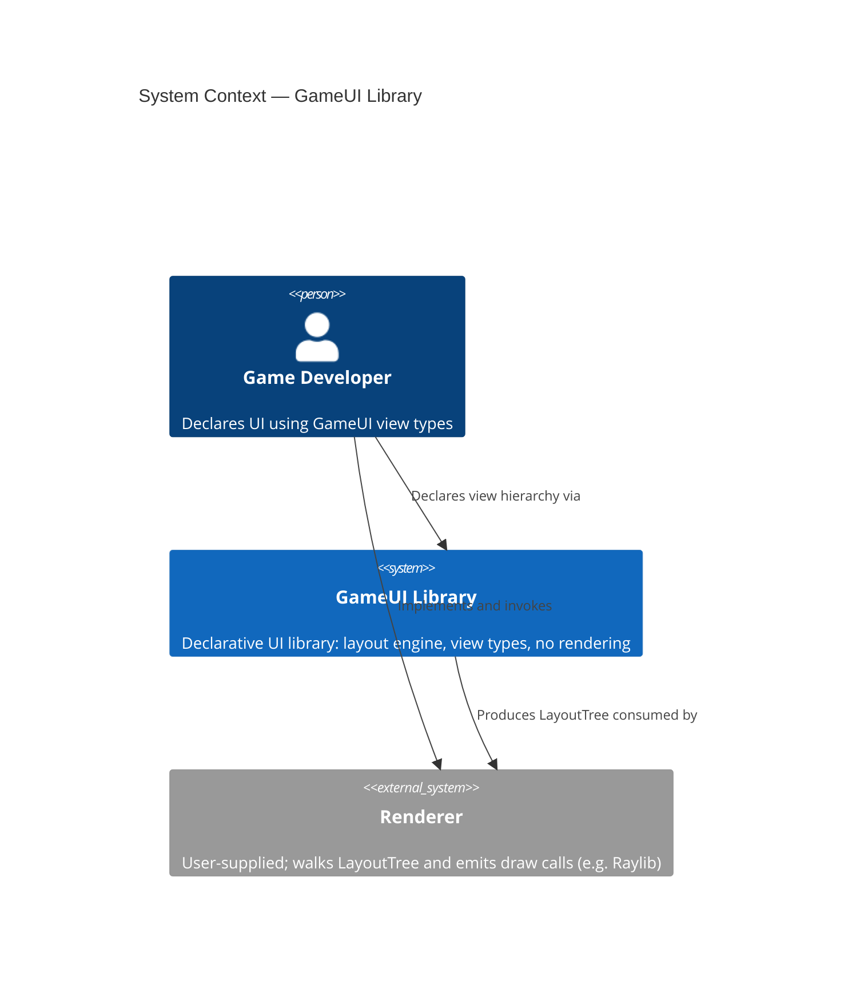
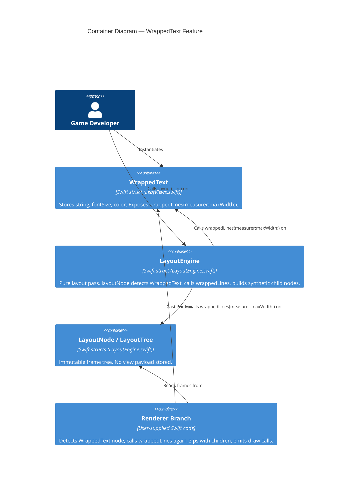
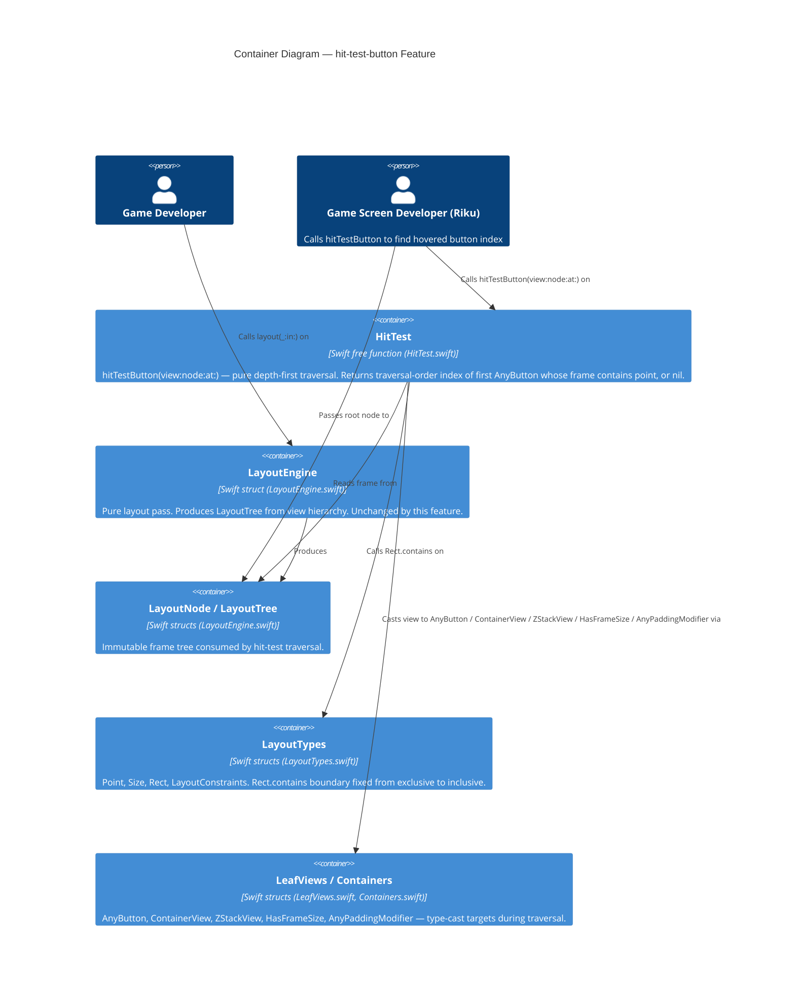
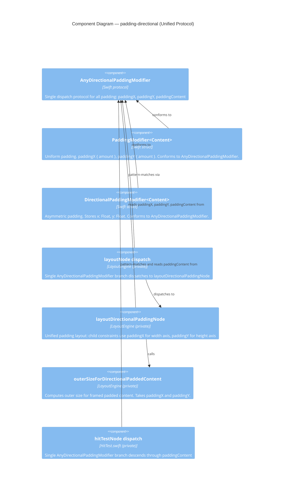

# Architecture Brief — GameUI

## Application Architecture

### Overview

The `WrappedText` feature is a modular extension to the existing `LayoutEngine`. It adds no new architectural layers, introduces no new protocols, and requires no changes to `LayoutNode`, `LayoutTree`, or `LayoutEngine`'s public surface. The design follows the established pattern of direct type-casts inside `layoutNode` (as used for `Text`, `AnyButton`, `ContainerView`, and `ZStackView`) and extends the renderer's `renderNode` function with an equivalent explicit branch.

The single source of truth for line splitting is a pure method `wrappedLines(measurer:maxWidth:) -> [String]` on `WrappedText` itself. Both the layout engine and the renderer call this method independently; because the method is deterministic and has no side effects, double invocation is safe and carries no correctness risk.

---

### Component Boundaries

| Component | Location | Responsibility | Boundary Rule |
|---|---|---|---|
| `WrappedText` struct | `Sources/GameUI/LeafViews.swift` | Stores `content: String`, `fontSize: Float`, `color: Color`. Exposes `wrappedLines(measurer:maxWidth:) -> [String]`. `body` is `Never`. | Value type. No children stored. No layout logic. |
| `layoutWrappedTextNode` branch | `Sources/GameUI/LayoutEngine.swift` — inside `layoutNode` | Detects `view as? WrappedText`, calls `wrappedLines`, produces one synthetic `Text` child node per line stacked vertically, returns root `LayoutNode`. Root frame: `width = constraints.maxWidth`, `height = lineCount × fontSize`. | No mutation. No new public API on `LayoutEngine`. |
| Renderer branch | Renderer (user-supplied) | Detects `node` where associated view is `WrappedText` (via `view as? WrappedText`), calls `wt.wrappedLines(measurer:maxWidth:)`, zips result with `node.children`, emits one draw call per line. | Read-only. No state. No coordination with layout engine beyond shared node tree. |

---

### Reuse Analysis

| Existing Component | File | Overlap | Decision | Justification |
|---|---|---|---|---|
| `Text` | `Sources/GameUI/LeafViews.swift` | Primitive view that measures and renders a single string | CREATE NEW | `Text` is deliberately single-line; its renderer emits one draw call and assumes one frame. Mixing wrapping semantics into `Text` would break the renderer's one-draw-call assumption for all existing `Text` nodes. |
| `layoutTextNode` | `Sources/GameUI/LayoutEngine.swift` | Text measurement fallback logic (`fontSize * charCount`) | DUPLICATE INLINE | The fallback is 4 lines. Extraction into a shared helper is premature at this scale and would entangle the two distinct measurement paths. |
| `ContainerView` | `Sources/GameUI/Containers.swift` | Children storage + vertical recursion pattern | NO REUSE (direct cast) | `WrappedText` has no `spacing` model, no `axis` property, and is not substitutable for `ContainerView`. A direct `is WrappedText` cast inside `layoutNode` is consistent with the existing style for `AnyButton` and `ZStackView`. |

---

### C4 System Context



---

### C4 Container Diagram



---

### Technology Stack

| Choice | Version / Detail | Rationale | License |
|---|---|---|---|
| Swift | 6.2 (existing project language) | No new dependency; matches all existing source files. | Apache 2.0 (Swift open-source toolchain) |
| `Float` geometry | Existing `Size`, `Rect`, `Point` types | Avoids Foundation/CGFloat import. Linux-compatible. Consistent with all existing measurement in `LayoutEngine`. | N/A (project-internal) |
| No Foundation | — | `wrappedLines` uses only Swift stdlib string splitting. No `NSAttributedString`, no `CGSize`. | N/A |

No third-party dependencies are introduced by this feature.

---

### Integration Points

**Existing injection point — `textMeasurer` closure**

`LayoutEngine` already accepts `textMeasurer: (@Sendable (String, Float) -> Size)?`. The `layoutWrappedTextNode` branch passes this same closure into `wrappedLines(measurer:maxWidth:)`. No new injection surface is needed.

```
wrappedLines(measurer: engine.textMeasurer, maxWidth: constraints.maxWidth) -> [String]
```

When `measurer` is `nil`, `wrappedLines` falls back to the same inline approximation already used in `layoutTextNode`: `fontSize * Float(word.count)`.

**Existing renderer pattern — `renderNode` recursion**

The renderer already walks `LayoutNode.children` recursively. The new branch fits the existing pattern:

```
if let wt = view as? WrappedText {
    let lines = wt.wrappedLines(measurer: textMeasurer, maxWidth: node.frame.size.width)
    zip(lines, node.children).forEach { line, child in
        // emit draw call for `line` at `child.frame`
    }
    return
}
```

---

### Renderer Contract

The `wrappedLines` method signature (interface contract, not implementation):

```
// On WrappedText:
func wrappedLines(
    measurer: (@Sendable (String, Float) -> Size)?,
    maxWidth: Float
) -> [String]
```

Guarantees the renderer may depend on:
- Return value is a `[String]` with at least one element (empty input returns `[""]` or `[]` — crafter decides; AC specifies observable behavior).
- No element, when measured with the same `measurer` and `fontSize`, exceeds `maxWidth`. (Safety guarantee — the crafter must prove this in tests.)
- Result is deterministic: same inputs produce same output always.
- No Foundation import, no side effects.

The renderer zips this `[String]` with `node.children` (guaranteed equal length by the layout pass). The renderer calls `wrappedLines` independently of the layout engine; the determinism guarantee makes this safe.

---

### Architectural Enforcement

The following tooling is recommended to prevent architectural drift:

| Rule | Tool | Check |
|---|---|---|
| `WrappedText.body` must be `Never` (no accidental body implementation) | Swift compiler | Enforced by type system: `body: Never { fatalError(...) }` pattern already in use for all leaf types |
| `WrappedText` must not import Foundation | `swift-package-manager` build flags / CI lint | Check for `import Foundation` in `LeafViews.swift` |
| `layoutNode` branch ordering (WrappedText before ContainerView fallback) | Code review + swift-testing unit test | Test: `WrappedText` must not fall through to the default fill-constraints node |
| `wrappedLines` must be pure (no stored state, no mutation) | `swift-testing` mutation tests + code review | Verified by calling twice with same inputs and asserting equal output |

---

### Quality Attribute Strategies

**Safety (ranked #1)**
- `wrappedLines` never crashes on empty string, zero `maxWidth`, or zero `fontSize`.
- AC specifies explicit boundary cases; crafter must provide property-based tests covering these inputs.
- `layoutWrappedTextNode` uses `max(0, ...)` guards on all Float arithmetic (consistent with `layoutPaddingNode` pattern).

**Correctness (ranked #2)**
- No child `LayoutNode` frame width exceeds `constraints.maxWidth`. Enforced structurally: each synthetic `Text` child is laid out with `maxWidth = constraints.maxWidth`.
- `wrappedLines` and `layoutWrappedTextNode` are the single algorithm path; no divergence between layout and render.

**Maintainability (ranked #3)**
- A renderer author needs to: (1) add one `if let wt = view as? WrappedText` branch, (2) call `wrappedLines`, (3) zip with children. Estimated time: under 15 minutes.
- The pattern is identical in shape to the existing `AnyButton` renderer branch.

**Purity (ranked #4)**
- No Foundation. No CGFloat. `Float` throughout. Linux CI will catch any inadvertent platform-specific import.

---

### Deployment Architecture

GameUI is a Swift Package. No deployment topology changes. `WrappedText` is a source addition inside the existing `GameUI` target. No new targets, no new modules, no new build phases.

---

*ADRs are in `docs/product/architecture/adr-*.md`.*

---

## hit-test-button Feature

### Overview

`hitTestButton` is a pure query function added to the GameUI public API. It traverses a view tree and its corresponding layout node tree in lockstep (depth-first, construction order), collecting `AnyButton` nodes, and returns the traversal-order index of the first button whose `LayoutNode.frame` contains the queried point, or `nil` if no button is hit.

The function is a brownfield extension. It adds no new protocols, no new structs, and no new types. It introduces one new file (`HitTest.swift`) and a one-character boundary fix to `Rect.contains` in `LayoutTypes.swift`. The established pattern of `if let x = view as? Protocol` direct type-casts is used throughout.

---

### Component Boundaries

| Component | Location | Responsibility | Boundary Rule |
|---|---|---|---|
| `hitTestButton(view:node:at:)` | `Sources/GameUI/HitTest.swift` — public free function | Accepts `any View` + `LayoutNode` + `Point`. Initiates depth-first traversal. Returns `Int?`. | Pure function. No side effects. No action invocation. Non-isolated (Swift 6.2 strict concurrency). |
| `hitTestNode(_:_:at:index:)` | `Sources/GameUI/HitTest.swift` — private recursive helper | Recursion kernel. Walks view+node in lockstep. Casts to `AnyButton`, `ContainerView`, `ZStackView`, `HasFrameSize`, `AnyPaddingModifier`. Accumulates button index. Returns `Int?`. | Private. No mutation. No new dependencies. |
| `Rect.contains(_ point: Point) -> Bool` | `Sources/GameUI/LayoutTypes.swift` — existing method, boundary fix | Tests whether a point lies inside or on the boundary of a rect. Uses `<=` on both axes (inclusive). | Pure. Value semantics. No Foundation. |

---

### Reuse Analysis

| Existing Component | File | Overlap | Decision | Justification |
|---|---|---|---|---|
| `Rect.contains(_ point: Point) -> Bool` | `Sources/GameUI/LayoutTypes.swift` | Point containment with exclusive upper bound (`<`) | EXTEND (fix semantics) | Method exists but uses strict `<`. AC requires inclusive boundary. Change `<` to `<=` on both axes. One-line fix, no new method. |
| `AnyButton` protocol | `Sources/GameUI/LeafViews.swift` | Type identity for button detection | REUSE AS-IS | `if let button = view as? AnyButton` pattern already validated in `LayoutEngine`. |
| `ContainerView` protocol | `Sources/GameUI/Containers.swift` | `containerChildren` for recursion | REUSE AS-IS | Traversal descends into container children via existing accessor. |
| `ZStackView` protocol | `Sources/GameUI/Containers.swift` | `zStackChildren` for z-ordered recursion | REUSE AS-IS | ZStack children must be traversed; accessor is the correct seam. |
| `HasFrameSize` protocol | `Sources/GameUI/View.swift` | `framedContent` accessor for FrameModifier | REUSE AS-IS | Traversal descends into framed content, consistent with `layoutNode` pattern. |
| `AnyPaddingModifier` protocol | `Sources/GameUI/View.swift` | `paddingContent` accessor for PaddingModifier | REUSE AS-IS | Traversal descends into padded content. |
| `layoutNode` (private, `LayoutEngine`) | `Sources/GameUI/LayoutEngine.swift` | Depth-first traversal pattern | REUSE AS REFERENCE | `layoutNode` is private and layout-coupled. Hit-test traversal is a separate read-only responsibility. New free function borrows the traversal pattern. No changes to `LayoutEngine`. |
| `LayoutEngine` struct | `Sources/GameUI/LayoutEngine.swift` | Existing public API | NO NEW MEMBERS | ODQ-02 pre-answered: free function, not a method on `LayoutEngine`. |

---

### C4 System Context

Unchanged from WrappedText section above — see `## Application Architecture` / `### C4 System Context`.

---

### C4 Container Diagram



---

### Technology Stack

Extends the existing table; no new entries required.

| Choice | Version / Detail | Rationale | License |
|---|---|---|---|
| Swift | 6.2 | No new dependency; matches all existing source files. | Apache 2.0 |
| `Float` geometry | Existing `Point`, `Size`, `Rect` types | Avoids Foundation/CGFloat. Linux-compatible. | N/A (project-internal) |
| No Foundation | — | `hitTestButton` uses only Swift stdlib and project-internal types. | N/A |

No third-party dependencies are introduced by this feature.

---

### Integration Points

**Public entry point**

```
public func hitTestButton(view: any View, node: LayoutNode, at point: Point) -> Int?
```

File: `Sources/GameUI/HitTest.swift`. Non-isolated. Pure. No `@Sendable` closure capture needed. Satisfies Swift 6.2 strict concurrency without annotations beyond the signature.

**`Rect.contains` fix**

`Sources/GameUI/LayoutTypes.swift` — change upper-bound operators from `<` to `<=` on both axes. This is a prerequisite: the existing test suite must remain green; new AC adds the boundary case. The one-line change has no impact on existing callers because layout containment tests in `LayoutEngine` never test edge equality (frames are constructed, not tested for containment).

**Traversal protocol chain (type-cast order)**

The private recursive helper mirrors the protocol-cast priority of `layoutNode`:
1. `AnyButton` — capture index, recurse into `anyContent` (buttons can contain nested views; nesting is permitted)
2. `ContainerView` — recurse into `containerChildren`
3. `ZStackView` — recurse into `zStackChildren`
4. `HasFrameSize` — recurse into `framedContent`
5. `AnyPaddingModifier` — recurse into `paddingContent`
6. Leaf (no children matched) — no recursion

---

### Architectural Enforcement

| Rule | Tool | Check |
|---|---|---|
| `hitTestButton` must never call `anyAction` | Swift compiler + code review | No call-site for `anyAction` in `HitTest.swift`; enforced by code review and CI test: "Does not invoke any button's action during traversal" (AC-07) |
| `HitTest.swift` must not import Foundation | CI build | Linux CI build catches any `import Foundation` |
| `Rect.contains` must use `<=` (inclusive) | Swift Testing acceptance test | AC-06 boundary test: `Point(x: 0, y: 100)` on edge must return index 0 |
| Traversal order must be depth-first construction order | Swift Testing acceptance test | AC-04 + nesting scenario tests enforce traversal order determinism |
| No new protocols or structs introduced | Code review + swift-package-manager build | `HitTest.swift` must contain only free functions; reviewer verifies no `protocol` or `struct` keyword beyond what exists |
| `Rect.contains` has no hidden callers outside `HitTest.swift` and `LayoutTypes.swift` | CI grep check | `grep -rn "\.contains(" Sources/` must not produce matches in files other than `LayoutTypes.swift` and `HitTest.swift`; catches accidental callers depending on old exclusive semantics |

---

### Quality Attribute Strategies

**Correctness (ranked #1)**

The function must return the correct index for all view-tree shapes: flat, nested, mixed containers. The view and node trees are structurally isomorphic (guaranteed by `LayoutEngine.layout`); the traversal walks both in lockstep. If the trees diverge (different layout pass), the function's behavior is undefined — this is documented as a precondition in the API comment, not a runtime guard (consistent with Swift standard library conventions).

**Purity (ranked #2)**

No side effects. No action invocation. No mutation. Pure function means it is safe to call multiple times per frame (e.g., once for hover, once for click detection).

**Maintainability (ranked #3)**

A caller needs to understand one function with one clear contract. The internal traversal mirrors the existing `layoutNode` pattern, meaning any developer familiar with `LayoutEngine` can understand and modify the traversal without new concepts.

**Safety (ranked #4)**

`Rect.contains` uses `<=` (inclusive). The function handles empty view trees (zero children) by returning `nil`. No crash on nil-equivalent inputs.

---

### Deployment Architecture

GameUI is a Swift Package. No deployment topology changes. `HitTest.swift` is a source addition inside the existing `GameUI` target. One-line fix to `LayoutTypes.swift`. No new targets, no new modules, no new build phases.

---

*ADRs are in `docs/product/architecture/adr-*.md`.*

---

## padding-directional Feature

### Overview

`padding(x:y:)` adds asymmetric horizontal/vertical padding as a modifier on `View`. The core architectural insight: uniform padding (`PaddingModifier`) is a special case of directional padding. Rather than introducing a parallel type hierarchy (two protocols, two dispatch branches), the design unifies both under `AnyDirectionalPaddingModifier`. `PaddingModifier` conforms to the new protocol by projecting its single `amount` onto both `paddingX` and `paddingY`.

This eliminates the dual-dispatch problem and halves the number of protocol checks in both `layoutNode` and `hitTestNode`. The concrete `padding(_ amount:)` API and return type are preserved verbatim — no call-site migration for existing game-developer code.

The "square is a special case of rectangle" analogy holds cleanly in immutable value types: there is no mutation after init, so no Liskov Substitution Principle violation is possible. The unification is semantically correct. See ADR-003.

---

### Component Boundaries

| Component | File | Responsibility | Boundary Rule |
|---|---|---|---|
| `AnyDirectionalPaddingModifier` | `Sources/GameUI/View.swift` | Single dispatch protocol for all padding. Members: `paddingX: Float`, `paddingY: Float`, `paddingContent: any View`. | Public protocol. No stored state. No default implementations. |
| `DirectionalPaddingModifier<Content>` | `Sources/GameUI/View.swift` | Asymmetric padding modifier. Stores `x: Float` and `y: Float`. Conforms to `AnyDirectionalPaddingModifier`. `body` is `Never`. | Value type. No layout logic. |
| `PaddingModifier<Content>` (extended) | `Sources/GameUI/View.swift` | Uniform padding modifier. Gains conformance to `AnyDirectionalPaddingModifier` via `paddingX { amount }` and `paddingY { amount }`. Loses `AnyPaddingModifier` conformance (protocol retired). | Value type. No new stored properties. Concrete API unchanged. |
| `View.padding(x:y:)` extension | `Sources/GameUI/View.swift` | Factory for `DirectionalPaddingModifier<Self>`. Returns concrete generic type. | Extension on `View`. No stored state. |
| `layoutDirectionalPaddingNode` | `Sources/GameUI/LayoutEngine.swift` | Unified layout handler for all padding nodes. Reads `paddingX`/`paddingY` from protocol; applies each axis independently to child constraints and child origin. Replaces `layoutPaddingNode`. | Private to `LayoutEngine`. No public API change. |
| `outerSizeForDirectionalPaddedContent` | `Sources/GameUI/LayoutEngine.swift` | Computes outer size for padded framed content. Accepts `paddingX` and `paddingY` as separate parameters. Replaces `outerSizeForPaddedContent`. | Private helper. Used only by `layoutDirectionalPaddingNode`. |

---

### Reuse Analysis

| Existing Component | File | Overlap | Decision | Justification |
|---|---|---|---|---|
| `PaddingModifier` | `Sources/GameUI/View.swift` | Uniform padding — degenerate case of directional padding | EXTEND (add conformance to `AnyDirectionalPaddingModifier`) | Projects `amount` onto both axes without loss. Concrete type preserved. |
| `AnyPaddingModifier` | `Sources/GameUI/View.swift` | Protocol for uniform padding dispatch | RETIRE | `AnyDirectionalPaddingModifier` subsumes all responsibilities. No public API surface callers. |
| `layoutPaddingNode` | `Sources/GameUI/LayoutEngine.swift` | Layout logic for uniform padding | REPLACE with `layoutDirectionalPaddingNode` | Single implementation handles both uniform and asymmetric cases. |
| `outerSizeForPaddedContent` | `Sources/GameUI/LayoutEngine.swift` | Outer size for framed padded content | REPLACE with `outerSizeForDirectionalPaddedContent(paddingX:paddingY:)` | Generalized signature; not duplicated. |
| `AnyPaddingModifier` branch in `layoutNode` | `Sources/GameUI/LayoutEngine.swift` | Dispatch to padding layout | REPLACE (single `AnyDirectionalPaddingModifier` branch) | Eliminates dispatch-order risk permanently. |
| `AnyPaddingModifier` branch in `hitTestNode` | `Sources/GameUI/HitTest.swift` | Traversal through padding | REPLACE (single `AnyDirectionalPaddingModifier` branch) | Same reasoning; traversal logic identical. |

---

### C4 Component Diagram



---

### Integration Points

**`layoutNode` — single dispatch branch:**

The `AnyPaddingModifier` check is removed and replaced by one `AnyDirectionalPaddingModifier` check at the same position in the dispatch chain. Both `PaddingModifier` and `DirectionalPaddingModifier` instances are handled by this single branch.

**`layoutDirectionalPaddingNode` behavioral contract:**

- Child width constraint: `max(0, outerWidth - 2 * paddingX)`
- Child height constraint: `max(0, outerHeight - 2 * paddingY)`
- Child origin x: `origin.x + paddingX`
- Child origin y: `origin.y + paddingY`
- Node width: `min(childNode.frame.size.width + 2 * paddingX, constraints.maxWidth)`
- Node height: `min(childNode.frame.size.height + 2 * paddingY, constraints.maxHeight)`

**`hitTestNode` — single dispatch branch:**

The `AnyPaddingModifier` check is replaced by one `AnyDirectionalPaddingModifier` check. The traversal behavior is identical: descend through `paddingContent`. No behavioral change for existing uniform padding.

---

### Breaking Changes

| Change | Type | Risk |
|---|---|---|
| `AnyPaddingModifier` protocol removed | Source-breaking | Low — not used as a return type, parameter type, or stored property type in any public function or struct. External callers referencing it by name are implementing custom layout engines (narrow use case). |
| `paddingAmount` property removed from `PaddingModifier` | Source-breaking | Low — was a protocol-requirement accessor, not an advertised `PaddingModifier` feature. Game-developer call-sites (`view.padding(8)`) are unaffected. |
| `layoutPaddingNode` and `outerSizeForPaddedContent` removed | Non-breaking | Zero — both are `private` to `LayoutEngine`. |

---

### Architecture Enforcement

| Rule | Tool | Check |
|---|---|---|
| All padding modifiers conform to `AnyDirectionalPaddingModifier` (not `AnyPaddingModifier`) | Swift compiler | `AnyPaddingModifier` is deleted; any remaining conformance declarations cause a compile error |
| No `import Foundation` in `View.swift` or `LayoutEngine.swift` | CI build (Linux runner) | Linux CI catches any inadvertent `import Foundation` |
| `AnyDirectionalPaddingModifier` is the only padding dispatch point in `layoutNode` | Swift Testing acceptance test | Test: both `PaddingModifier` and `DirectionalPaddingModifier` nodes must reach `layoutDirectionalPaddingNode` (verified by layout metric assertions in acceptance tests) |
| `hitTestNode` traverses directional padding correctly | Swift Testing acceptance test | AC for US-PDR-02: button wrapped in `DirectionalPaddingModifier` must be hit-testable; button outside padded frame must return nil |
| Dispatch order preserved: `AnyDirectionalPaddingModifier` after `ContainerView`, before default fallback | Code review + layout test | Existing `ContainerView` layout tests must remain green after the change |

---

*ADRs are in `docs/product/architecture/adr-*.md`.*
