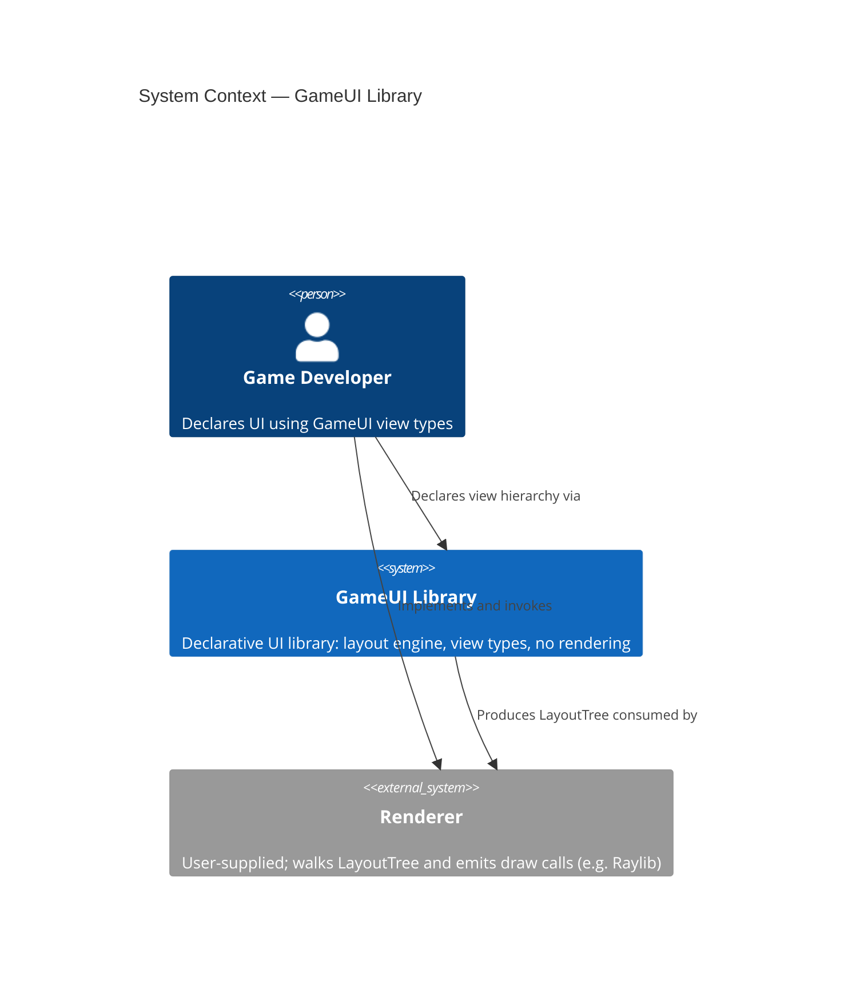
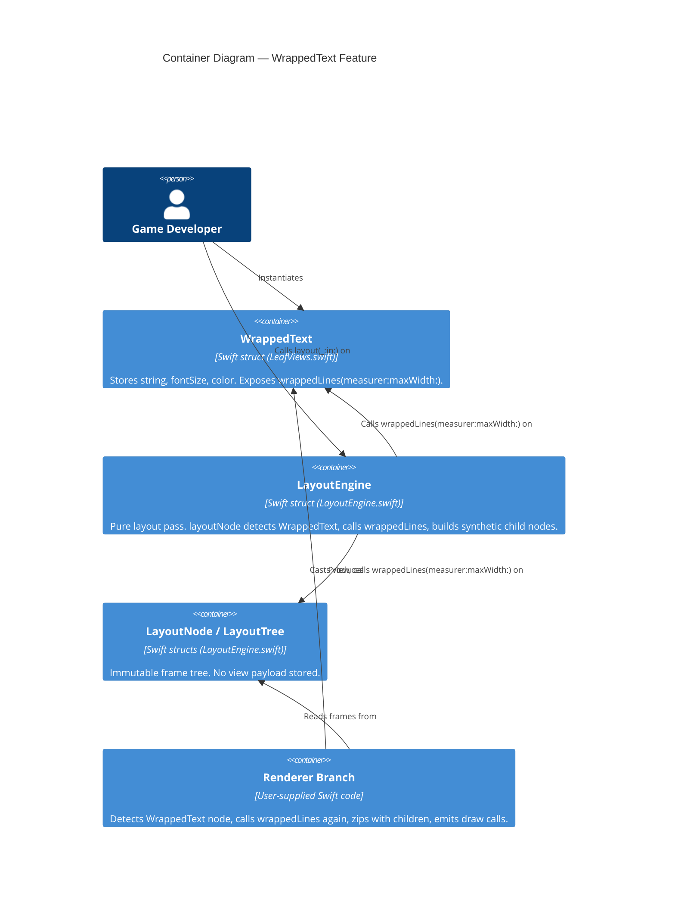
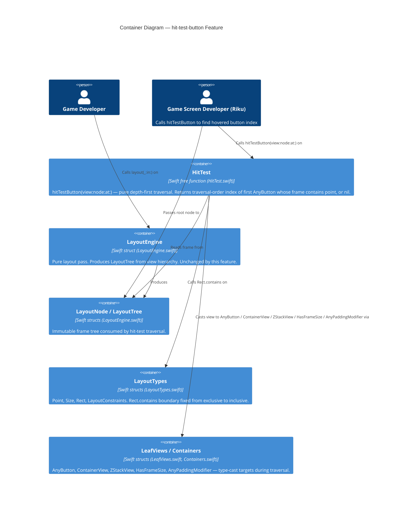
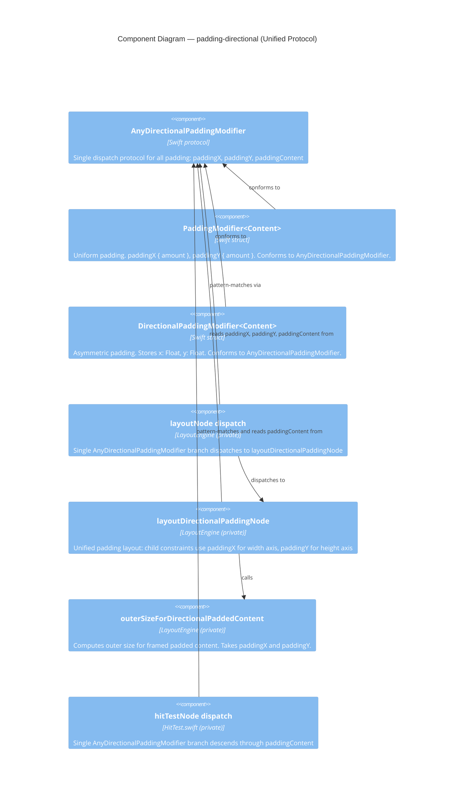
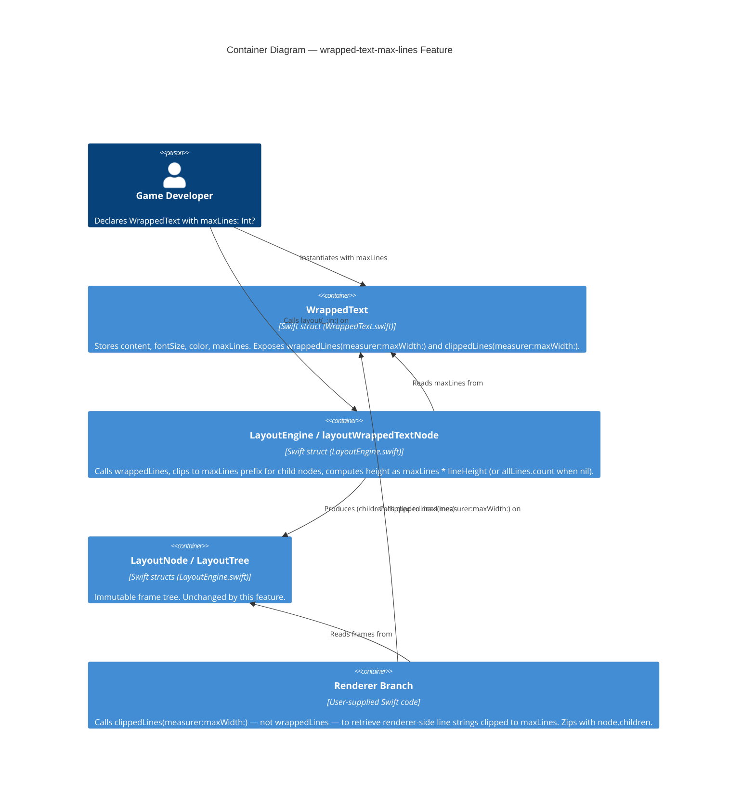
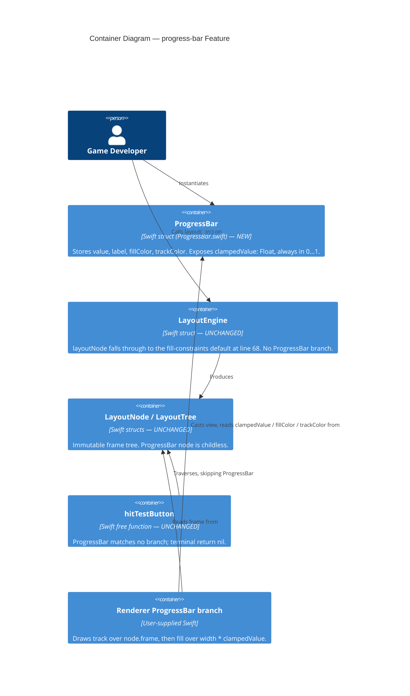

# Architecture Brief — GameUI

## Application Architecture

### Overview

The `WrappedText` feature is a modular extension to the existing `LayoutEngine`. It adds no new architectural layers, introduces no new protocols, and requires no changes to `LayoutNode`, `LayoutTree`, or `LayoutEngine`'s public surface. The design follows the established pattern of direct type-casts inside `layoutNode` (as used for `Text`, `AnyButton`, `ContainerView`, and `ZStackView`) and extends the renderer's `renderNode` function with an equivalent explicit branch.

The single source of truth for line splitting is a pure method `wrappedLines(measurer:maxWidth:) -> [String]` on `WrappedText` itself. Both the layout engine and the renderer call this method independently; because the method is deterministic and has no side effects, double invocation is safe and carries no correctness risk.

---

### Component Boundaries

| Component | Location | Responsibility | Boundary Rule |
|---|---|---|---|
| `WrappedText` struct | `Sources/GameUI/LeafViews.swift` | Stores `content: String`, `fontSize: Float`, `color: Color`. Exposes `wrappedLines(measurer:maxWidth:) -> [String]`. `body` is `Never`. | Value type. No children stored. No layout logic. |
| `layoutWrappedTextNode` branch | `Sources/GameUI/LayoutEngine.swift` — inside `layoutNode` | Detects `view as? WrappedText`, calls `wrappedLines`, produces one synthetic `Text` child node per line stacked vertically, returns root `LayoutNode`. Root frame: `width = constraints.maxWidth`, `height = lineCount × fontSize`. | No mutation. No new public API on `LayoutEngine`. |
| Renderer branch | Renderer (user-supplied) | Detects `node` where associated view is `WrappedText` (via `view as? WrappedText`), calls `wt.wrappedLines(measurer:maxWidth:)`, zips result with `node.children`, emits one draw call per line. | Read-only. No state. No coordination with layout engine beyond shared node tree. |

---

### Reuse Analysis

| Existing Component | File | Overlap | Decision | Justification |
|---|---|---|---|---|
| `Text` | `Sources/GameUI/LeafViews.swift` | Primitive view that measures and renders a single string | CREATE NEW | `Text` is deliberately single-line; its renderer emits one draw call and assumes one frame. Mixing wrapping semantics into `Text` would break the renderer's one-draw-call assumption for all existing `Text` nodes. |
| `layoutTextNode` | `Sources/GameUI/LayoutEngine.swift` | Text measurement fallback logic (`fontSize * charCount`) | DUPLICATE INLINE | The fallback is 4 lines. Extraction into a shared helper is premature at this scale and would entangle the two distinct measurement paths. |
| `ContainerView` | `Sources/GameUI/Containers.swift` | Children storage + vertical recursion pattern | NO REUSE (direct cast) | `WrappedText` has no `spacing` model, no `axis` property, and is not substitutable for `ContainerView`. A direct `is WrappedText` cast inside `layoutNode` is consistent with the existing style for `AnyButton` and `ZStackView`. |

---

### C4 System Context



---

### C4 Container Diagram



---

### Technology Stack

| Choice | Version / Detail | Rationale | License |
|---|---|---|---|
| Swift | 6.2 (existing project language) | No new dependency; matches all existing source files. | Apache 2.0 (Swift open-source toolchain) |
| `Float` geometry | Existing `Size`, `Rect`, `Point` types | Avoids Foundation/CGFloat import. Linux-compatible. Consistent with all existing measurement in `LayoutEngine`. | N/A (project-internal) |
| No Foundation | — | `wrappedLines` uses only Swift stdlib string splitting. No `NSAttributedString`, no `CGSize`. | N/A |

No third-party dependencies are introduced by this feature.

---

### Integration Points

**Existing injection point — `textMeasurer` closure**

`LayoutEngine` already accepts `textMeasurer: (@Sendable (String, Float) -> Size)?`. The `layoutWrappedTextNode` branch passes this same closure into `wrappedLines(measurer:maxWidth:)`. No new injection surface is needed.

```
wrappedLines(measurer: engine.textMeasurer, maxWidth: constraints.maxWidth) -> [String]
```

When `measurer` is `nil`, `wrappedLines` falls back to the same inline approximation already used in `layoutTextNode`: `fontSize * Float(word.count)`.

**Existing renderer pattern — `renderNode` recursion**

The renderer already walks `LayoutNode.children` recursively. The new branch fits the existing pattern:

```
if let wt = view as? WrappedText {
    let lines = wt.wrappedLines(measurer: textMeasurer, maxWidth: node.frame.size.width)
    zip(lines, node.children).forEach { line, child in
        // emit draw call for `line` at `child.frame`
    }
    return
}
```

---

### Renderer Contract

The `wrappedLines` method signature (interface contract, not implementation):

```
// On WrappedText:
func wrappedLines(
    measurer: (@Sendable (String, Float) -> Size)?,
    maxWidth: Float
) -> [String]
```

Guarantees the renderer may depend on:
- Return value is a `[String]` with at least one element (empty input returns `[""]` or `[]` — crafter decides; AC specifies observable behavior).
- No element, when measured with the same `measurer` and `fontSize`, exceeds `maxWidth`. (Safety guarantee — the crafter must prove this in tests.)
- Result is deterministic: same inputs produce same output always.
- No Foundation import, no side effects.

The renderer zips this `[String]` with `node.children` (guaranteed equal length by the layout pass). The renderer calls `wrappedLines` independently of the layout engine; the determinism guarantee makes this safe.

---

### Architectural Enforcement

The following tooling is recommended to prevent architectural drift:

| Rule | Tool | Check |
|---|---|---|
| `WrappedText.body` must be `Never` (no accidental body implementation) | Swift compiler | Enforced by type system: `body: Never { fatalError(...) }` pattern already in use for all leaf types |
| `WrappedText` must not import Foundation | `swift-package-manager` build flags / CI lint | Check for `import Foundation` in `LeafViews.swift` |
| `layoutNode` branch ordering (WrappedText before ContainerView fallback) | Code review + swift-testing unit test | Test: `WrappedText` must not fall through to the default fill-constraints node |
| `wrappedLines` must be pure (no stored state, no mutation) | `swift-testing` mutation tests + code review | Verified by calling twice with same inputs and asserting equal output |

---

### Quality Attribute Strategies

**Safety (ranked #1)**
- `wrappedLines` never crashes on empty string, zero `maxWidth`, or zero `fontSize`.
- AC specifies explicit boundary cases; crafter must provide property-based tests covering these inputs.
- `layoutWrappedTextNode` uses `max(0, ...)` guards on all Float arithmetic (consistent with `layoutPaddingNode` pattern).

**Correctness (ranked #2)**
- No child `LayoutNode` frame width exceeds `constraints.maxWidth`. Enforced structurally: each synthetic `Text` child is laid out with `maxWidth = constraints.maxWidth`.
- `wrappedLines` and `layoutWrappedTextNode` are the single algorithm path; no divergence between layout and render.

**Maintainability (ranked #3)**
- A renderer author needs to: (1) add one `if let wt = view as? WrappedText` branch, (2) call `wrappedLines`, (3) zip with children. Estimated time: under 15 minutes.
- The pattern is identical in shape to the existing `AnyButton` renderer branch.

**Purity (ranked #4)**
- No Foundation. No CGFloat. `Float` throughout. Enforced by CI: `.forgejo/workflows/ci.yml` builds on Linux ARM64 and runs a `constraints` job that fails on any `import Foundation`/`Darwin`/`Glibc` or any `CGFloat`/`Double` in `Sources/`.

---

### Deployment Architecture

GameUI is a Swift Package. No deployment topology changes. `WrappedText` is a source addition inside the existing `GameUI` target. No new targets, no new modules, no new build phases.

---

*ADRs are in `docs/product/architecture/adr-*.md`.*

---

## hit-test-button Feature

### Overview

`hitTestButton` is a pure query function added to the GameUI public API. It traverses a view tree and its corresponding layout node tree in lockstep (depth-first, construction order), collecting `AnyButton` nodes, and returns the traversal-order index of the first button whose `LayoutNode.frame` contains the queried point, or `nil` if no button is hit.

The function is a brownfield extension. It adds no new protocols, no new structs, and no new types. It introduces one new file (`HitTest.swift`) and a one-character boundary fix to `Rect.contains` in `LayoutTypes.swift`. The established pattern of `if let x = view as? Protocol` direct type-casts is used throughout.

---

### Component Boundaries

| Component | Location | Responsibility | Boundary Rule |
|---|---|---|---|
| `hitTestButton(view:node:at:)` | `Sources/GameUI/HitTest.swift` — public free function | Accepts `any View` + `LayoutNode` + `Point`. Initiates depth-first traversal. Returns `Int?`. | Pure function. No side effects. No action invocation. Non-isolated (Swift 6.2 strict concurrency). |
| `hitTestNode(_:_:at:index:)` | `Sources/GameUI/HitTest.swift` — private recursive helper | Recursion kernel. Walks view+node in lockstep. Casts to `AnyButton`, `ContainerView`, `ZStackView`, `HasFrameSize`, `AnyPaddingModifier`. Accumulates button index. Returns `Int?`. | Private. No mutation. No new dependencies. |
| `Rect.contains(_ point: Point) -> Bool` | `Sources/GameUI/LayoutTypes.swift` — existing method, boundary fix | Tests whether a point lies inside or on the boundary of a rect. Uses `<=` on both axes (inclusive). | Pure. Value semantics. No Foundation. |

---

### Reuse Analysis

| Existing Component | File | Overlap | Decision | Justification |
|---|---|---|---|---|
| `Rect.contains(_ point: Point) -> Bool` | `Sources/GameUI/LayoutTypes.swift` | Point containment with exclusive upper bound (`<`) | EXTEND (fix semantics) | Method exists but uses strict `<`. AC requires inclusive boundary. Change `<` to `<=` on both axes. One-line fix, no new method. |
| `AnyButton` protocol | `Sources/GameUI/LeafViews.swift` | Type identity for button detection | REUSE AS-IS | `if let button = view as? AnyButton` pattern already validated in `LayoutEngine`. |
| `ContainerView` protocol | `Sources/GameUI/Containers.swift` | `containerChildren` for recursion | REUSE AS-IS | Traversal descends into container children via existing accessor. |
| `ZStackView` protocol | `Sources/GameUI/Containers.swift` | `zStackChildren` for z-ordered recursion | REUSE AS-IS | ZStack children must be traversed; accessor is the correct seam. |
| `HasFrameSize` protocol | `Sources/GameUI/View.swift` | `framedContent` accessor for FrameModifier | REUSE AS-IS | Traversal descends into framed content, consistent with `layoutNode` pattern. |
| `AnyPaddingModifier` protocol | `Sources/GameUI/View.swift` | `paddingContent` accessor for PaddingModifier | REUSE AS-IS | Traversal descends into padded content. |
| `layoutNode` (private, `LayoutEngine`) | `Sources/GameUI/LayoutEngine.swift` | Depth-first traversal pattern | REUSE AS REFERENCE | `layoutNode` is private and layout-coupled. Hit-test traversal is a separate read-only responsibility. New free function borrows the traversal pattern. No changes to `LayoutEngine`. |
| `LayoutEngine` struct | `Sources/GameUI/LayoutEngine.swift` | Existing public API | NO NEW MEMBERS | ODQ-02 pre-answered: free function, not a method on `LayoutEngine`. |

---

### C4 System Context

Unchanged from WrappedText section above — see `## Application Architecture` / `### C4 System Context`.

---

### C4 Container Diagram



---

### Technology Stack

Extends the existing table; no new entries required.

| Choice | Version / Detail | Rationale | License |
|---|---|---|---|
| Swift | 6.2 | No new dependency; matches all existing source files. | Apache 2.0 |
| `Float` geometry | Existing `Point`, `Size`, `Rect` types | Avoids Foundation/CGFloat. Linux-compatible. | N/A (project-internal) |
| No Foundation | — | `hitTestButton` uses only Swift stdlib and project-internal types. | N/A |

No third-party dependencies are introduced by this feature.

---

### Integration Points

**Public entry point**

```
public func hitTestButton(view: any View, node: LayoutNode, at point: Point) -> Int?
```

File: `Sources/GameUI/HitTest.swift`. Non-isolated. Pure. No `@Sendable` closure capture needed. Satisfies Swift 6.2 strict concurrency without annotations beyond the signature.

**`Rect.contains` fix**

`Sources/GameUI/LayoutTypes.swift` — change upper-bound operators from `<` to `<=` on both axes. This is a prerequisite: the existing test suite must remain green; new AC adds the boundary case. The one-line change has no impact on existing callers because layout containment tests in `LayoutEngine` never test edge equality (frames are constructed, not tested for containment).

**Traversal protocol chain (type-cast order)**

The private recursive helper mirrors the protocol-cast priority of `layoutNode`:
1. `AnyButton` — capture index, recurse into `anyContent` (buttons can contain nested views; nesting is permitted)
2. `ContainerView` — recurse into `containerChildren`
3. `ZStackView` — recurse into `zStackChildren`
4. `HasFrameSize` — recurse into `framedContent`
5. `AnyPaddingModifier` — recurse into `paddingContent`
6. Leaf (no children matched) — no recursion

---

### Architectural Enforcement

| Rule | Tool | Check |
|---|---|---|
| `hitTestButton` must never call `anyAction` | Swift compiler + code review | No call-site for `anyAction` in `HitTest.swift`; enforced by code review and CI test: "Does not invoke any button's action during traversal" (AC-07) |
| `HitTest.swift` must not import Foundation | CI (`.forgejo/workflows/ci.yml`) | `constraints` job greps `Sources/`; `test-linux` job would also fail to compile |
| `Rect.contains` must use `<=` (inclusive) | Swift Testing acceptance test | AC-06 boundary test: `Point(x: 0, y: 100)` on edge must return index 0 |
| Traversal order must be depth-first construction order | Swift Testing acceptance test | AC-04 + nesting scenario tests enforce traversal order determinism |
| No new protocols or structs introduced | Code review + swift-package-manager build | `HitTest.swift` must contain only free functions; reviewer verifies no `protocol` or `struct` keyword beyond what exists |
| `Rect.contains` has no hidden callers outside `HitTest.swift` and `LayoutTypes.swift` | CI grep check | `grep -rn "\.contains(" Sources/` must not produce matches in files other than `LayoutTypes.swift` and `HitTest.swift`; catches accidental callers depending on old exclusive semantics |

---

### Quality Attribute Strategies

**Correctness (ranked #1)**

The function must return the correct index for all view-tree shapes: flat, nested, mixed containers. The view and node trees are structurally isomorphic (guaranteed by `LayoutEngine.layout`); the traversal walks both in lockstep. If the trees diverge (different layout pass), the function's behavior is undefined — this is documented as a precondition in the API comment, not a runtime guard (consistent with Swift standard library conventions).

**Purity (ranked #2)**

No side effects. No action invocation. No mutation. Pure function means it is safe to call multiple times per frame (e.g., once for hover, once for click detection).

**Maintainability (ranked #3)**

A caller needs to understand one function with one clear contract. The internal traversal mirrors the existing `layoutNode` pattern, meaning any developer familiar with `LayoutEngine` can understand and modify the traversal without new concepts.

**Safety (ranked #4)**

`Rect.contains` uses `<=` (inclusive). The function handles empty view trees (zero children) by returning `nil`. No crash on nil-equivalent inputs.

---

### Deployment Architecture

GameUI is a Swift Package. No deployment topology changes. `HitTest.swift` is a source addition inside the existing `GameUI` target. One-line fix to `LayoutTypes.swift`. No new targets, no new modules, no new build phases.

---

*ADRs are in `docs/product/architecture/adr-*.md`.*

---

## padding-directional Feature

### Overview

`padding(x:y:)` adds asymmetric horizontal/vertical padding as a modifier on `View`. The core architectural insight: uniform padding (`PaddingModifier`) is a special case of directional padding. Rather than introducing a parallel type hierarchy (two protocols, two dispatch branches), the design unifies both under `AnyDirectionalPaddingModifier`. `PaddingModifier` conforms to the new protocol by projecting its single `amount` onto both `paddingX` and `paddingY`.

This eliminates the dual-dispatch problem and halves the number of protocol checks in both `layoutNode` and `hitTestNode`. The concrete `padding(_ amount:)` API and return type are preserved verbatim — no call-site migration for existing game-developer code.

The "square is a special case of rectangle" analogy holds cleanly in immutable value types: there is no mutation after init, so no Liskov Substitution Principle violation is possible. The unification is semantically correct. See ADR-003.

---

### Component Boundaries

| Component | File | Responsibility | Boundary Rule |
|---|---|---|---|
| `AnyDirectionalPaddingModifier` | `Sources/GameUI/View.swift` | Single dispatch protocol for all padding. Members: `paddingX: Float`, `paddingY: Float`, `paddingContent: any View`. | Public protocol. No stored state. No default implementations. |
| `DirectionalPaddingModifier<Content>` | `Sources/GameUI/View.swift` | Asymmetric padding modifier. Stores `x: Float` and `y: Float`. Conforms to `AnyDirectionalPaddingModifier`. `body` is `Never`. | Value type. No layout logic. |
| `PaddingModifier<Content>` (extended) | `Sources/GameUI/View.swift` | Uniform padding modifier. Gains conformance to `AnyDirectionalPaddingModifier` via `paddingX { amount }` and `paddingY { amount }`. Loses `AnyPaddingModifier` conformance (protocol retired). | Value type. No new stored properties. Concrete API unchanged. |
| `View.padding(x:y:)` extension | `Sources/GameUI/View.swift` | Factory for `DirectionalPaddingModifier<Self>`. Returns concrete generic type. | Extension on `View`. No stored state. |
| `layoutDirectionalPaddingNode` | `Sources/GameUI/LayoutEngine.swift` | Unified layout handler for all padding nodes. Reads `paddingX`/`paddingY` from protocol; applies each axis independently to child constraints and child origin. Replaces `layoutPaddingNode`. | Private to `LayoutEngine`. No public API change. |
| `outerSizeForDirectionalPaddedContent` | `Sources/GameUI/LayoutEngine.swift` | Computes outer size for padded framed content. Accepts `paddingX` and `paddingY` as separate parameters. Replaces `outerSizeForPaddedContent`. | Private helper. Used only by `layoutDirectionalPaddingNode`. |

---

### Reuse Analysis

| Existing Component | File | Overlap | Decision | Justification |
|---|---|---|---|---|
| `PaddingModifier` | `Sources/GameUI/View.swift` | Uniform padding — degenerate case of directional padding | EXTEND (add conformance to `AnyDirectionalPaddingModifier`) | Projects `amount` onto both axes without loss. Concrete type preserved. |
| `AnyPaddingModifier` | `Sources/GameUI/View.swift` | Protocol for uniform padding dispatch | RETIRE | `AnyDirectionalPaddingModifier` subsumes all responsibilities. No public API surface callers. |
| `layoutPaddingNode` | `Sources/GameUI/LayoutEngine.swift` | Layout logic for uniform padding | REPLACE with `layoutDirectionalPaddingNode` | Single implementation handles both uniform and asymmetric cases. |
| `outerSizeForPaddedContent` | `Sources/GameUI/LayoutEngine.swift` | Outer size for framed padded content | REPLACE with `outerSizeForDirectionalPaddedContent(paddingX:paddingY:)` | Generalized signature; not duplicated. |
| `AnyPaddingModifier` branch in `layoutNode` | `Sources/GameUI/LayoutEngine.swift` | Dispatch to padding layout | REPLACE (single `AnyDirectionalPaddingModifier` branch) | Eliminates dispatch-order risk permanently. |
| `AnyPaddingModifier` branch in `hitTestNode` | `Sources/GameUI/HitTest.swift` | Traversal through padding | REPLACE (single `AnyDirectionalPaddingModifier` branch) | Same reasoning; traversal logic identical. |

---

### C4 Component Diagram



---

### Integration Points

**`layoutNode` — single dispatch branch:**

The `AnyPaddingModifier` check is removed and replaced by one `AnyDirectionalPaddingModifier` check at the same position in the dispatch chain. Both `PaddingModifier` and `DirectionalPaddingModifier` instances are handled by this single branch.

**`layoutDirectionalPaddingNode` behavioral contract:**

- Child width constraint: `max(0, outerWidth - 2 * paddingX)`
- Child height constraint: `max(0, outerHeight - 2 * paddingY)`
- Child origin x: `origin.x + paddingX`
- Child origin y: `origin.y + paddingY`
- Node width: `min(childNode.frame.size.width + 2 * paddingX, constraints.maxWidth)`
- Node height: `min(childNode.frame.size.height + 2 * paddingY, constraints.maxHeight)`

**`hitTestNode` — single dispatch branch:**

The `AnyPaddingModifier` check is replaced by one `AnyDirectionalPaddingModifier` check. The traversal behavior is identical: descend through `paddingContent`. No behavioral change for existing uniform padding.

---

### Breaking Changes

| Change | Type | Risk |
|---|---|---|
| `AnyPaddingModifier` protocol removed | Source-breaking | Low — not used as a return type, parameter type, or stored property type in any public function or struct. External callers referencing it by name are implementing custom layout engines (narrow use case). |
| `paddingAmount` property removed from `PaddingModifier` | Source-breaking | Low — was a protocol-requirement accessor, not an advertised `PaddingModifier` feature. Game-developer call-sites (`view.padding(8)`) are unaffected. |
| `layoutPaddingNode` and `outerSizeForPaddedContent` removed | Non-breaking | Zero — both are `private` to `LayoutEngine`. |

---

### Architecture Enforcement

| Rule | Tool | Check |
|---|---|---|
| All padding modifiers conform to `AnyDirectionalPaddingModifier` (not `AnyPaddingModifier`) | Swift compiler | `AnyPaddingModifier` is deleted; any remaining conformance declarations cause a compile error |
| No `import Foundation` in `View.swift` or `LayoutEngine.swift` | CI (`.forgejo/workflows/ci.yml`) | `constraints` job greps `Sources/`; `test-linux` job would also fail to compile |
| `AnyDirectionalPaddingModifier` is the only padding dispatch point in `layoutNode` | Swift Testing acceptance test | Test: both `PaddingModifier` and `DirectionalPaddingModifier` nodes must reach `layoutDirectionalPaddingNode` (verified by layout metric assertions in acceptance tests) |
| `hitTestNode` traverses directional padding correctly | Swift Testing acceptance test | AC for US-PDR-02: button wrapped in `DirectionalPaddingModifier` must be hit-testable; button outside padded frame must return nil |
| Dispatch order preserved: `AnyDirectionalPaddingModifier` after `ContainerView`, before default fallback | Code review + layout test | Existing `ContainerView` layout tests must remain green after the change |

---

*ADRs are in `docs/product/architecture/adr-*.md`.*

---

## wrapped-text-max-lines Feature

### Overview

`wrapped-text-max-lines` is a brownfield intrinsic-property extension to the existing `WrappedText` leaf view. It adds one optional stored property (`maxLines: Int?`) to the `WrappedText` struct and extends `layoutWrappedTextNode` with a clipping + height-reservation step that runs after the existing greedy `wrappedLines` call. No new protocols, no new types, no new public API on `LayoutEngine`. The `maxLines == nil` path is a strict no-op relative to the pre-feature implementation.

The single architectural complexity is the renderer coordination problem: when `maxLines` is set, the renderer must zip against the *clipped* line set, not the full `wrappedLines` output. ADR-004 resolves this.

---

### Component Boundaries

| Component | File | Responsibility | Boundary Rule |
|---|---|---|---|
| `WrappedText` struct | `Sources/GameUI/WrappedText.swift` | Gains `maxLines: Int?` stored property (default `nil`). Gains `clippedLines(measurer:maxWidth:) -> [String]` pure method that applies `maxLines` clipping after `wrappedLines`. Init updated to accept `maxLines`. | Value type. No layout logic. All new methods pure. `body` remains `Never`. |
| `layoutWrappedTextNode` branch | `Sources/GameUI/LayoutEngine.swift` | After calling `wrappedLines`, clips to `maxLines` via `allLines.prefix(maxLines ?? allLines.count)` for child nodes. Computes reserved height as `Float(maxLines ?? allLines.count) * lineHeight`. Clipping and height are decoupled. | No new public API on `LayoutEngine`. Private branch only. |
| `LayoutNode` / `LayoutTree` | `Sources/GameUI/LayoutEngine.swift` | Unchanged. | No new members. |
| Renderer branch | User-supplied renderer | Must call `wt.clippedLines(measurer:maxWidth:)` — not `wrappedLines` — to retrieve renderer-side line strings. The clipped method returns the same prefix that the layout engine produced, keeping child-count and line-array in sync. | Read-only. Deterministic. No layout coupling beyond shared `LayoutNode`. |

---

### Reuse Analysis

| Existing Component | File | Overlap | Decision | Justification |
|---|---|---|---|---|
| `WrappedText` struct | `Sources/GameUI/WrappedText.swift` | Stores `content`, `fontSize`, `color`; exposes `wrappedLines` | EXTEND | Add `maxLines: Int?` stored property and `clippedLines(measurer:maxWidth:)` method. No existing responsibilities change. |
| `wrappedLines(measurer:maxWidth:)` | `Sources/GameUI/WrappedText.swift` | Full greedy line-splitting algorithm | REUSE AS-IS | Called unchanged by both `layoutWrappedTextNode` (as first step) and as internal input to `clippedLines`. The splitting algorithm itself does not need to know about `maxLines`. |
| `layoutWrappedTextNode` | `Sources/GameUI/LayoutEngine.swift` | Calls `wrappedLines`, builds child `LayoutNode` array, computes root height | EXTEND | Add two lines post-`wrappedLines` call: prefix-clip for visible lines, `maxLines`-driven height formula. Existing logic path unchanged when `maxLines == nil`. |
| `LayoutNode`, `LayoutTree`, `LayoutEngine` public API | `Sources/GameUI/LayoutEngine.swift` | Layout tree data structures and engine entry points | NO CHANGE | The feature adds no new types, no new public surface, and requires no structural changes to the tree. |
| `textMeasurer` closure on `LayoutEngine` | `Sources/GameUI/LayoutEngine.swift` | Injected text measurement function | REUSE AS-IS | `clippedLines` accepts the same `(@Sendable (String, Float) -> Size)?` signature; the same measurer is passed through unchanged. |
| `.frame(height:)` modifier / `HasFrameSize` | `Sources/GameUI/View.swift` | Reserved-height via wrapper modifier | REJECTED (design constraint) | `RecordingGameUIAdapter` requires a `HasFrameSize` traversal fix to see content behind a `FrameModifier`. Intrinsic property keeps `WrappedText` directly visible in the view tree. Non-negotiable per DISCUSS constraint. |

---

### C4 System Context

Unchanged — see `## Application Architecture / ### C4 System Context`. The system boundary (game developer, GameUI library, user-supplied renderer) is not modified by this feature.

---

### C4 Container Diagram



---

### Technology Stack

No changes from the established stack.

| Choice | Version / Detail | Rationale | License |
|---|---|---|---|
| Swift | 6.2 | No new dependency. | Apache 2.0 |
| `Float` geometry | Existing `Size`, `Rect`, `Point` types | No Foundation. No CGFloat. Consistent with all existing layout arithmetic. | N/A (project-internal) |
| No Foundation | — | `clippedLines` uses only Swift stdlib (`Array.prefix`). | N/A |

No third-party dependencies are introduced by this feature.

---

### Integration Points

**`wrappedLines` — unchanged call site in `layoutWrappedTextNode`**

The layout engine calls `wrappedLines` first (unchanged), then applies the `maxLines` prefix and height formula:

```
allLines        = wrappedText.wrappedLines(measurer:maxWidth:)
visibleLines    = Array(allLines.prefix(maxLines ?? allLines.count))
lineHeight      = textMeasurer?(representativeWord, fontSize).height ?? fontSize
reservedHeight  = Float(maxLines ?? allLines.count) * lineHeight
```

Height uses `maxLines` (not `visibleLines.count`). This is the floor+ceiling guarantee.

**`clippedLines` — renderer call site**

Renderer calls `wt.clippedLines(measurer:maxWidth:)` in place of `wt.wrappedLines(...)`. The method applies the same prefix inside `WrappedText` so the renderer does not duplicate the clipping logic.

**`lineHeight` source for empty content with `maxLines` set**

When content is empty, `allLines` is `[]`. Height must still be `Float(maxLines) * lineHeight`. `lineHeight` is derived from the measurer using any non-empty probe string (the existing `fontSize` fallback applies when no measurer is injected). The formula is evaluated in `layoutWrappedTextNode` where `textMeasurer` is in scope.

---

### Renderer Contract Amendment

`WrappedText` exposes two pure methods from this feature forward:

| Method | Caller | Returns |
|---|---|---|
| `wrappedLines(measurer:maxWidth:)` | `layoutWrappedTextNode` (layout engine internal) | All wrapped lines — no `maxLines` clipping |
| `clippedLines(measurer:maxWidth:)` | Renderer branch | `wrappedLines` output prefix-clipped to `maxLines`; count equals `node.children.count` |

Invariant: `clippedLines(...).count == node.children.count` when the node was produced by the same `LayoutEngine` instance with the same measurer and constraints. This is the renderer's safety guarantee.

---

### Architectural Enforcement

| Rule | Tool | Check |
|---|---|---|
| `maxLines` is a stored property on `WrappedText`, not a modifier | Swift compiler + code review | No `HasFrameSize` conformance added; `WrappedText` must not appear in the `if let framed = view as? HasFrameSize` dispatch path |
| Reserved height uses `maxLines` count, not `visibleLines.count` | Swift Testing acceptance test | AC: `maxLines: 3`, content wraps to 1 line → `root.frame.size.height == 3 * fontSize` |
| `clippedLines` and `wrappedLines` both pure | Swift Testing determinism test | Call each twice with same inputs, assert equal output both times |
| Renderer calls `clippedLines`, not `wrappedLines` | Doc comment on `wrappedLines` + code review | `wrappedLines` doc comment states: "Call `clippedLines` from renderers when `maxLines` may be set" |
| `maxLines: nil` path is output-identical to pre-feature | Regression test | All existing `WrappedTextSlice1CoreTests`, `WrappedTextSlice2RobustnessTests`, `WrappedTextSlice3RendererTests` pass without modification |
| No `import Foundation` in `WrappedText.swift` | CI (`.forgejo/workflows/ci.yml`) | `constraints` job greps `Sources/`; `test-linux` job would also fail to compile |

---

### Quality Attribute Strategies

**Correctness (ranked #1)**

The floor+ceiling invariant — `root.frame.size.height == Float(maxLines) * lineHeight` for any content length including empty — is the primary correctness guarantee. It is achieved by separating height computation (`maxLines`-driven) from child-node generation (`visibleLines.count`-driven). These two values must never be conflated.

**Safety (ranked #2)**

- `maxLines: 0`: `allLines.prefix(0) == []`; height = `0 * lineHeight == 0.0`. Natural outcome, no special guard.
- `maxLines: 1` with unbreakable word: existing US-02 guard inside `wrappedLines` already places the word on its own line; `prefix(1)` then keeps that single entry.
- Empty content with non-nil `maxLines`: `allLines == []`; `prefix(n) == []`; height = `Float(maxLines) * lineHeight` (explicit formula, not `allLines.count`-based). Requires the `maxLines`-first height formula.

**Backward Compatibility (ranked #3)**

`maxLines == nil` path: `prefix(allLines.count) == allLines`; `Float(allLines.count) * lineHeight` is the existing formula. Identical output. All pre-feature acceptance tests must remain green.

**Maintainability (ranked #4)**

Two lines of change in `layoutWrappedTextNode`. One new stored property and one new pure method on `WrappedText`. No protocol changes, no new types, no new dispatch branches. Change surface is minimal.

---

### Deployment Architecture

GameUI is a Swift Package. No deployment topology changes. Changes are confined to `Sources/GameUI/WrappedText.swift` (property + method addition) and `Sources/GameUI/LayoutEngine.swift` (targeted modification inside existing private branch). No new targets, modules, or build phases.

---

*ADRs are in `docs/product/architecture/adr-*.md`.*

---

## progress-bar Feature

### Overview

`ProgressBar` is a display-only leaf view that turns a `0.0…1.0` magnitude into a bar with a track
and a proportional fill. It is the smallest possible brownfield addition: **one new file, zero
modified files**. No new protocol, no `LayoutEngine` branch, no `HitTest.swift` change.

Two properties make it more than a data holder. First, `clampedValue` — a pure computed accessor
guaranteeing a value in `0…1` for *every* `Float` including `NaN` and `±infinity` — so no renderer
needs a defensive guard. Second, the deliberate decision **not** to unify with `Slider`, despite
their structural similarity. See ADR-005.

---

### Component Boundaries

| Component | Location | Responsibility | Boundary Rule |
|---|---|---|---|
| `ProgressBar` struct | `Sources/GameUI/ProgressBar.swift` | Stores `value: Float`, `label: String`, `fillColor: Color`, `trackColor: Color`. Exposes `clampedValue: Float`. | Value type. No children. No layout logic. `body` is `Never`. Must not conform to any dispatch protocol. |
| `layoutNode` default branch | `Sources/GameUI/LayoutEngine.swift:68` | Produces a childless node filling the constraint box. | **Unchanged.** `ProgressBar` falls through to it, as `Slider` and `Checkbox` already do. |
| `hitTestNode` terminal branch | `Sources/GameUI/HitTest.swift` | Returns `nil` for any view matching no protocol. | **Unchanged.** `ProgressBar` is never reported as hit. |
| Renderer branch | User-supplied | Casts `view as? ProgressBar`; draws track over `node.frame`, then fill over `width * clampedValue`. | Read-only. Deterministic. Draw order is normative. |

---

### Reuse Analysis

| Existing Component | File | Overlap | Decision | Justification |
|---|---|---|---|---|
| `Slider` | `Sources/GameUI/Slider.swift` | `value` + `label`; a bar with proportional fill | CREATE NEW | ADR-003's distinguishing-operation test **fails** here: invoking `onTap` distinguishes the types post-construction, so they are not substitutable even as immutable values. `Slider` is `ProgressBar` plus an affordance, not a widening of it. See ADR-005. |
| `layoutNode` fill-constraints default | `LayoutEngine.swift:68` | Childless node filling constraints | REUSE AS-IS | Already exactly the required behaviour. A dedicated branch would duplicate the default. |
| `hitTestNode` | `HitTest.swift` | Traversal that must not reach `ProgressBar` | REUSE AS-IS | Matches no branch → terminal `return nil`. The guarantee is provided by the *absence* of code. |
| `Rectangle` | `LeafViews.swift` | A coloured rect | CREATE NEW | Composing two `Rectangle`s in a `ZStack` is the workaround this feature exists to eliminate — it returns the fill arithmetic to the call site. |
| `Color` | `Color.swift` | `.green`, `.darkGray` defaults | REUSE AS-IS | Palette already carries both. No new constants. |
| `WrappedText.clippedLines` | `WrappedText.swift` | Pure derived accessor read by the renderer | REUSE AS PATTERN | `clampedValue` is the same contract shape (ADR-001/ADR-004 lineage). No shared code. |

---

### C4 Container Diagram



---

### Technology Stack

No changes to the established stack: Swift 6.2, `Float` geometry, no Foundation, no third-party
dependencies. `clampedValue` uses only comparison operators — notably **not** `min`/`max`, which
propagate `NaN`.

---

### Renderer Contract

Guarantees a renderer may depend on:

- `clampedValue ∈ 0.0...1.0` for every `Float` input; `NaN → 0.0`, `+∞ → 1.0`, `-∞ → 0.0`
- `clampedValue == value` exactly for in-range input, including both endpoints
- Deterministic and pure — safe to read repeatedly within a frame
- The `ProgressBar`'s own `LayoutNode` has `children.isEmpty == true`
- `hitTestButton` never returns an index attributable to a `ProgressBar`

```
if let pb = view as? ProgressBar {
    draw(rect: node.frame, color: pb.trackColor)
    let fillWidth = node.frame.size.width * pb.clampedValue
    draw(rect: Rect(origin: node.frame.origin,
                    size: Size(width: fillWidth, height: node.frame.size.height)),
         color: pb.fillColor)
    return
}
```

Track first, then fill — reversing the order hides the fill. Read `clampedValue`, never `value`.

---

### Architectural Enforcement

| Rule | Tool | Check |
|---|---|---|
| `ProgressBar` must not conform to any dispatch protocol | Code review + acceptance test | Conformance to `AnyButton` / `ContainerView` / `ZStackView` / `HasFrameSize` / `AnyDirectionalPaddingModifier` silently redirects both layout and hit-test. AC-04 and AC-06 detect it. |
| `clampedValue` must not use `min`/`max` | Code review + NaN acceptance test | `min`/`max` propagate `NaN`; AC-10 (`NaN → 0.0`) fails if they are used. |
| `clampedValue` is always in `0...1` | Swift Testing property test | AC-12, over a curated special-value set plus a random sweep. |
| `value` remains readable verbatim | Swift Testing acceptance test | AC-14 — clamping is a render guarantee, not data loss. |
| No `import Foundation` in `ProgressBar.swift` | CI (`.forgejo/workflows/ci.yml`) | `constraints` job greps `Sources/`; `test-linux` job would also fail to compile |
| No existing source file modified | `git diff --stat` at review | The feature's regression guarantee is structural: only `ProgressBar.swift` is added. |

---

### Quality Attribute Strategies

**Safety (#1)** — `clampedValue` is total: defined for every `Float`, no crash, no overflow, no
propagated `NaN`. The display-only shape means there is no callback that can fire unexpectedly.

**Correctness (#2)** — the fill width `frame.size.width * clampedValue` is exact at the
acceptance points (`200 × 0.65 == 130.0` exactly in `Float`).

**Maintainability (#3)** — a renderer author adds one cast and three lines of geometry. Zero
existing files change.

**Purity (#4)** — no Foundation, no `CGFloat`, `Float` throughout. `clampedValue` is a pure
function of one stored property.

---

### Deployment Architecture

GameUI is a Swift Package. `ProgressBar.swift` is a source addition inside the existing `GameUI`
target. No new targets, modules, or build phases.

---

*ADRs are in `docs/product/architecture/adr-*.md`. This feature: ADR-005.*
