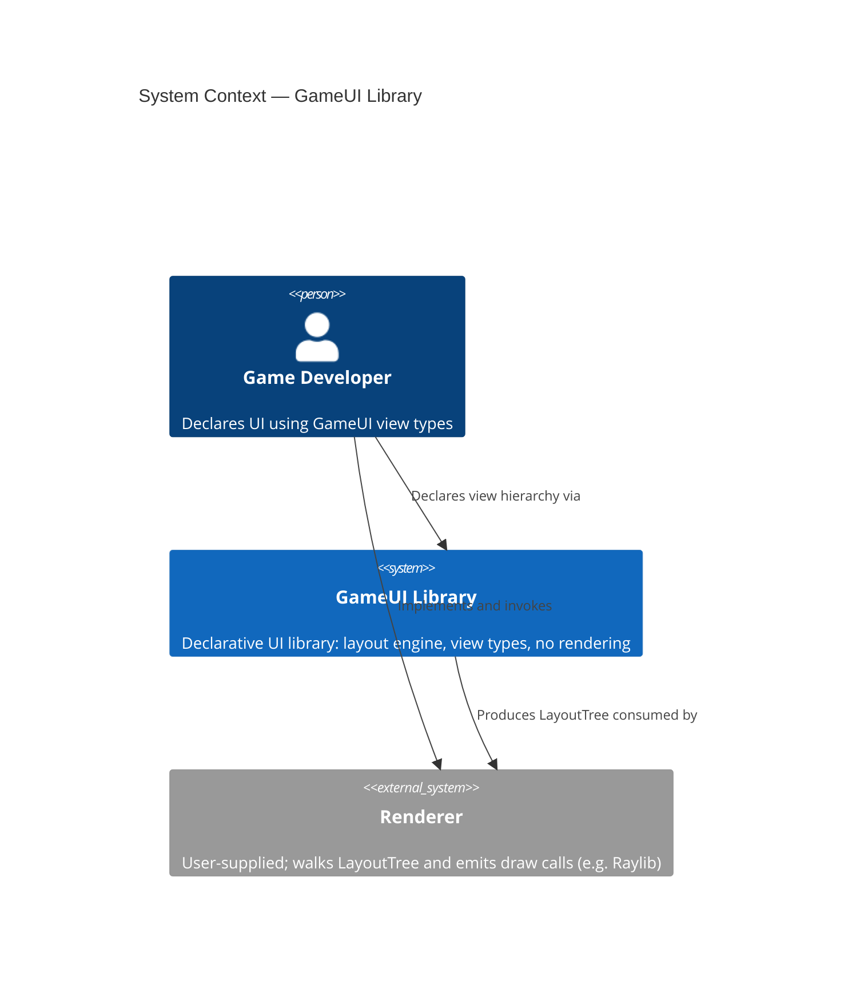
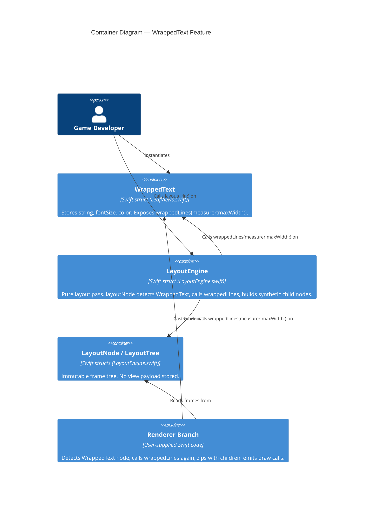

# Architecture Brief — GameUI

## Application Architecture

### Overview

The `WrappedText` feature is a modular extension to the existing `LayoutEngine`. It adds no new architectural layers, introduces no new protocols, and requires no changes to `LayoutNode`, `LayoutTree`, or `LayoutEngine`'s public surface. The design follows the established pattern of direct type-casts inside `layoutNode` (as used for `Text`, `AnyButton`, `ContainerView`, and `ZStackView`) and extends the renderer's `renderNode` function with an equivalent explicit branch.

The single source of truth for line splitting is a pure method `wrappedLines(measurer:maxWidth:) -> [String]` on `WrappedText` itself. Both the layout engine and the renderer call this method independently; because the method is deterministic and has no side effects, double invocation is safe and carries no correctness risk.

---

### Component Boundaries

| Component | Location | Responsibility | Boundary Rule |
|---|---|---|---|
| `WrappedText` struct | `Sources/GameUI/LeafViews.swift` | Stores `content: String`, `fontSize: Float`, `color: Color`. Exposes `wrappedLines(measurer:maxWidth:) -> [String]`. `body` is `Never`. | Value type. No children stored. No layout logic. |
| `layoutWrappedTextNode` branch | `Sources/GameUI/LayoutEngine.swift` — inside `layoutNode` | Detects `view as? WrappedText`, calls `wrappedLines`, produces one synthetic `Text` child node per line stacked vertically, returns root `LayoutNode`. Root frame: `width = constraints.maxWidth`, `height = lineCount × fontSize`. | No mutation. No new public API on `LayoutEngine`. |
| Renderer branch | Renderer (user-supplied) | Detects `node` where associated view is `WrappedText` (via `view as? WrappedText`), calls `wt.wrappedLines(measurer:maxWidth:)`, zips result with `node.children`, emits one draw call per line. | Read-only. No state. No coordination with layout engine beyond shared node tree. |

---

### Reuse Analysis

| Existing Component | File | Overlap | Decision | Justification |
|---|---|---|---|---|
| `Text` | `Sources/GameUI/LeafViews.swift` | Primitive view that measures and renders a single string | CREATE NEW | `Text` is deliberately single-line; its renderer emits one draw call and assumes one frame. Mixing wrapping semantics into `Text` would break the renderer's one-draw-call assumption for all existing `Text` nodes. |
| `layoutTextNode` | `Sources/GameUI/LayoutEngine.swift` | Text measurement fallback logic (`fontSize * charCount`) | DUPLICATE INLINE | The fallback is 4 lines. Extraction into a shared helper is premature at this scale and would entangle the two distinct measurement paths. |
| `ContainerView` | `Sources/GameUI/Containers.swift` | Children storage + vertical recursion pattern | NO REUSE (direct cast) | `WrappedText` has no `spacing` model, no `axis` property, and is not substitutable for `ContainerView`. A direct `is WrappedText` cast inside `layoutNode` is consistent with the existing style for `AnyButton` and `ZStackView`. |

---

### C4 System Context



---

### C4 Container Diagram



---

### Technology Stack

| Choice | Version / Detail | Rationale | License |
|---|---|---|---|
| Swift | 6.2 (existing project language) | No new dependency; matches all existing source files. | Apache 2.0 (Swift open-source toolchain) |
| `Float` geometry | Existing `Size`, `Rect`, `Point` types | Avoids Foundation/CGFloat import. Linux-compatible. Consistent with all existing measurement in `LayoutEngine`. | N/A (project-internal) |
| No Foundation | — | `wrappedLines` uses only Swift stdlib string splitting. No `NSAttributedString`, no `CGSize`. | N/A |

No third-party dependencies are introduced by this feature.

---

### Integration Points

**Existing injection point — `textMeasurer` closure**

`LayoutEngine` already accepts `textMeasurer: (@Sendable (String, Float) -> Size)?`. The `layoutWrappedTextNode` branch passes this same closure into `wrappedLines(measurer:maxWidth:)`. No new injection surface is needed.

```
wrappedLines(measurer: engine.textMeasurer, maxWidth: constraints.maxWidth) -> [String]
```

When `measurer` is `nil`, `wrappedLines` falls back to the same inline approximation already used in `layoutTextNode`: `fontSize * Float(word.count)`.

**Existing renderer pattern — `renderNode` recursion**

The renderer already walks `LayoutNode.children` recursively. The new branch fits the existing pattern:

```
if let wt = view as? WrappedText {
    let lines = wt.wrappedLines(measurer: textMeasurer, maxWidth: node.frame.size.width)
    zip(lines, node.children).forEach { line, child in
        // emit draw call for `line` at `child.frame`
    }
    return
}
```

---

### Renderer Contract

The `wrappedLines` method signature (interface contract, not implementation):

```
// On WrappedText:
func wrappedLines(
    measurer: (@Sendable (String, Float) -> Size)?,
    maxWidth: Float
) -> [String]
```

Guarantees the renderer may depend on:
- Return value is a `[String]` with at least one element (empty input returns `[""]` or `[]` — crafter decides; AC specifies observable behavior).
- No element, when measured with the same `measurer` and `fontSize`, exceeds `maxWidth`. (Safety guarantee — the crafter must prove this in tests.)
- Result is deterministic: same inputs produce same output always.
- No Foundation import, no side effects.

The renderer zips this `[String]` with `node.children` (guaranteed equal length by the layout pass). The renderer calls `wrappedLines` independently of the layout engine; the determinism guarantee makes this safe.

---

### Architectural Enforcement

The following tooling is recommended to prevent architectural drift:

| Rule | Tool | Check |
|---|---|---|
| `WrappedText.body` must be `Never` (no accidental body implementation) | Swift compiler | Enforced by type system: `body: Never { fatalError(...) }` pattern already in use for all leaf types |
| `WrappedText` must not import Foundation | `swift-package-manager` build flags / CI lint | Check for `import Foundation` in `LeafViews.swift` |
| `layoutNode` branch ordering (WrappedText before ContainerView fallback) | Code review + swift-testing unit test | Test: `WrappedText` must not fall through to the default fill-constraints node |
| `wrappedLines` must be pure (no stored state, no mutation) | `swift-testing` mutation tests + code review | Verified by calling twice with same inputs and asserting equal output |

---

### Quality Attribute Strategies

**Safety (ranked #1)**
- `wrappedLines` never crashes on empty string, zero `maxWidth`, or zero `fontSize`.
- AC specifies explicit boundary cases; crafter must provide property-based tests covering these inputs.
- `layoutWrappedTextNode` uses `max(0, ...)` guards on all Float arithmetic (consistent with `layoutPaddingNode` pattern).

**Correctness (ranked #2)**
- No child `LayoutNode` frame width exceeds `constraints.maxWidth`. Enforced structurally: each synthetic `Text` child is laid out with `maxWidth = constraints.maxWidth`.
- `wrappedLines` and `layoutWrappedTextNode` are the single algorithm path; no divergence between layout and render.

**Maintainability (ranked #3)**
- A renderer author needs to: (1) add one `if let wt = view as? WrappedText` branch, (2) call `wrappedLines`, (3) zip with children. Estimated time: under 15 minutes.
- The pattern is identical in shape to the existing `AnyButton` renderer branch.

**Purity (ranked #4)**
- No Foundation. No CGFloat. `Float` throughout. Linux CI will catch any inadvertent platform-specific import.

---

### Deployment Architecture

GameUI is a Swift Package. No deployment topology changes. `WrappedText` is a source addition inside the existing `GameUI` target. No new targets, no new modules, no new build phases.

---

*ADRs are in `docs/product/architecture/adr-*.md`.*
